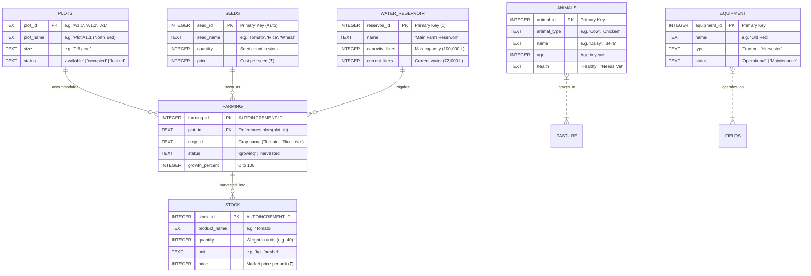
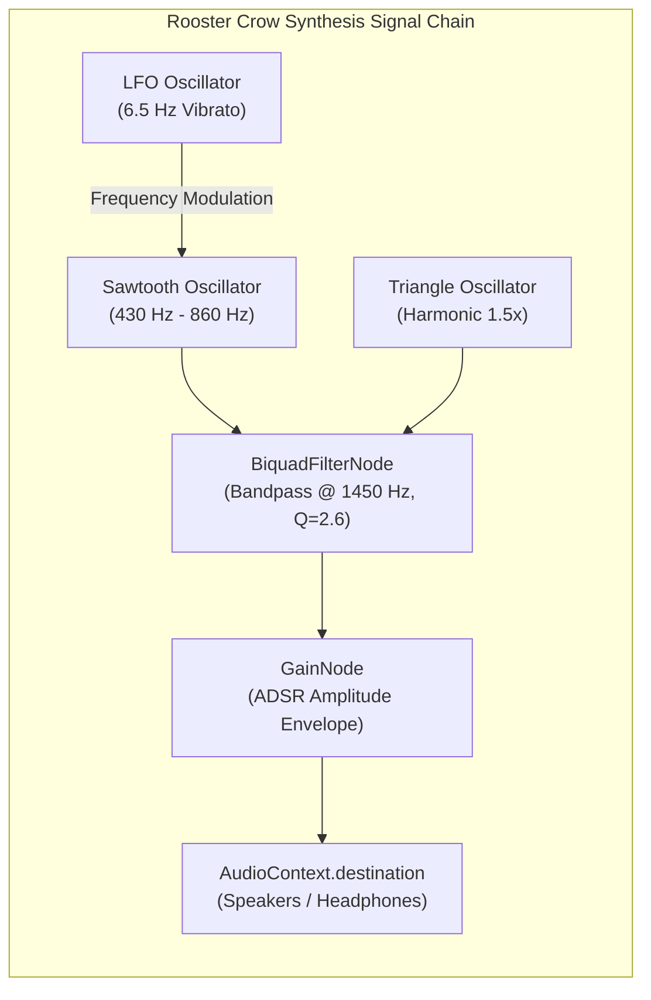

# 🚜 FARMDB: Comprehensive Architectural & Technical Explanation

> **An in-depth guide to the internal architecture, SQLite WebAssembly data pipeline, reactive game loop, agricultural simulation physics, procedural audio synthesis, and educational validation engine of FARMDB.**

---

## 📑 Table of Contents

1. [Introduction & Executive Summary](#1-introduction--executive-summary)
2. [System Architecture & Component Topology](#2-system-architecture--component-topology)
3. [The SQLite 3 WebAssembly Execution Pipeline](#3-the-sqlite-3-webassembly-execution-pipeline)
4. [Relational Data Model & Agricultural Schemas](#4-relational-data-model--agricultural-schemas)
5. [The Living Agricultural Simulation Engine](#5-the-living-agricultural-simulation-engine)
6. [Celestial Mechanics & Atmospheric Day/Night Engine](#6-celestial-mechanics--atmospheric-daynight-engine)
7. [Pedagogical Curriculum & Dynamic Mission Validation](#7-pedagogical-curriculum--dynamic-mission-validation)
8. [Procedural Web Audio Engine (100% Synthetic Sound)](#8-procedural-web-audio-engine-100-synthetic-sound)
9. [UI/UX Subsystems: Windowing & Living Farm Canvas](#9-uiux-subsystems-windowing--living-farm-canvas)
10. [State Persistence & Recovery Model](#10-state-persistence--recovery-model)
11. [Developer Diagnostics & Automated Verification Testbeds](#11-developer-diagnostics--automated-verification-testbeds)
12. [Extensibility Guide: Adding Levels, Crops & Mechanics](#12-extensibility-guide-adding-levels-crops--mechanics)

---

## 1. Introduction & Executive Summary

### 1.1 The Core Problem in Database Education
Traditional SQL learning environments suffer from an abstraction disconnect: students type abstract queries against arbitrary tables (`employees`, `orders`, `departments`) and receive raw tabular grids in return. There is no tangible mental model for:
- Why data integrity constraints matter.
- How an `UPDATE` cascades into operational state.
- How relational records map to real-world resources.
- Why transactions and multi-table queries exist.

### 1.2 The FARMDB Solution
**FARMDB** bridges this gap by grounding relational database theory in **tangible agricultural mechanics**. The player is an agricultural operator who inherits a family farm with a notebook of scribbled records and an advisor, Uncle Somu. Every agricultural task is an authentic database operation:
- Cataloging seed inventory requires `CREATE TABLE` and `INSERT INTO`.
- Identifying empty acreage requires `SELECT ... WHERE status = 'available'`.
- Planting a field is a multi-table state transition (`UPDATE seeds`, `INSERT INTO farming`, `UPDATE plots`).
- Maturing crops demands resource tracking (`UPDATE farming`, `UPDATE water_reservoir`).
- Harvesting crops and selling produce demands relational aggregation and inventory depletion.

### 1.3 Architectural Tenets
1. **100% Client-Side Execution**: Zero backend server, zero latency, zero cloud dependency. A full SQLite 3 instance compiles into WebAssembly (`sql.js`) and runs directly in the user's browser memory thread.
2. **Reactive Visual Synchronization**: Database mutations trigger immediate visual transitions on the farm canvas without page reloads.
3. **Mathematical Procedural Audio**: Zero MP3/WAV network requests. All sound effects (rooster crows, tractor engines, water splashes, coins, bird calls) are synthesized procedurally via the Web Audio API.
4. **Vanilla Modular Web Architecture**: Pure ES6+ JavaScript modules, semantic HTML5, and bespoke CSS3 variables without bulky framework overhead.

---

## 2. System Architecture & Component Topology

FARMDB employs an event-driven, unidirectional state flow mediated by a centralized orchestrator (`FarmDBApp`).

### 2.1 Component Interaction Diagram

```mermaid
graph TB
    subgraph Browser ["Client Browser Runtime"]
        subgraph UI ["Presentation & Interaction Layer"]
            Term["Floating SQL Terminal & Studio\n(draggable.js / terminal.css)"]
            Canvas["Living Farm Canvas\n(farmRenderer.js / farm.css)"]
            TopNav["Top Navigation Bar\n(layout.css)"]
            Modals["Dialogs & Inspectors\n(Notebook, Celebration, Debug)"]
            Login["Living Login Screen\n(loginView.js / login.css)"]
        end

        subgraph Core ["Application Orchestrator (src/main.js)"]
            App["FarmDBApp Orchestrator\n• Event Wiring\n• Tab Switching\n• Toast System"]
        end

        subgraph StateLayer ["Game State & Agricultural Physics"]
            GS["GameState (state.js)\n• Day / Hour / Minute\n• Cash & XP\n• Active Level & Mission\n• localStorage Sync"]
            SIM["SimulationEngine (simulation.js)\n• Baseline Seeders\n• Plot Sub-bed Unlocking\n• Day Progression (+35% Growth)\n• Water Depletion (-400L)"]
            MIS["MissionsData (missions.js)\n• Objectives & Dialogues\n• 3-Tier Hints\n• Validation Predicates"]
        end

        subgraph DatabaseEngine ["SQLite 3 WebAssembly Layer (src/sql/engine.js)"]
            WASM["SQLite 3 Engine (sql.js)\n• In-Memory VFS\n• exec() Pipeline"]
            PRAGMA["PRAGMA & Schema Introspector\n• sqlite_master\n• PRAGMA table_info"]
            Triggers["Dedup Triggers & AST Normalizer"]
            Bus["Database Change Notification Bus\n(listeners array)"]
        end

        subgraph AudioSynth ["Procedural Audio Subsystem (src/visuals/audio.js)"]
            Audio["SoundController\n• Web Audio API Context\n• Oscillators & Formant Filters\n• LFO Vibrato\n• Ambient Scheduling"]
        end
    end

    %% Flow connections
    Term -->|SQL Query Submission| App
    App -->|execute(sql)| WASM
    WASM -->|DB Mutation| Bus
    Bus -->|Notify Change Event| Canvas
    Bus -->|Notify Change Event| App
    App -->|Re-render ERD & Schema| PRAGMA
    App -->|Evaluate Mission State| MIS
    MIS -->|Validate(db, queryResult)| WASM
    MIS -->|Mission Passed| GS
    App -->|Synthesize Feedback Sound| Audio
    TopNav -->|Advance Day Event| SIM
    SIM -->|UPDATE farming & water_reservoir| WASM
    SIM -->|Advance Time / Weather| GS
    GS -->|Notify State Change| TopNav
    GS -->|Calculate Sun Trajectory| Canvas
```

### 2.2 Module Directory & Responsibilities

| Module Path | Core Class / Object | Primary Responsibilities |
|:---|:---|:---|
| `src/main.js` | `FarmDBApp` | Orchestrates all subsystems, attaches global event listeners, runs keyboard shortcuts, renders query results, formats tables, and handles level completions. |
| `src/sql/engine.js` | `SQLEngine` (`sqlEngine`) | Boots the WebAssembly binary, executes arbitrary SQL, provides educational error diagnostics, inspects schema via `PRAGMA`, and triggers change listeners. |
| `src/game/state.js` | `GameState` (`gameState`) | Single source of truth for player progression (Level, Mission, Cash, XP, Badges, Day, Hour, Time-of-Day phase), serializing to `localStorage`. |
| `src/game/simulation.js` | `SimulationEngine` (`simulation`) | Manages environmental tables (`plots`, `water_reservoir`), models crop growth (+35%/day), calculates water drawdown, and progressive plot unlocking. |
| `src/game/missions.js` | `MISSIONS_DATA` | Holds narrative text, Uncle Somu dialogues, 3-tier hints, quick-fill queries, and functional validation predicates for Levels 1–10. |
| `src/visuals/farmRenderer.js` | `FarmRenderer` (`farmRenderer`) | Renders SVG plots, crops across 5 growth stages, water ripples, cows, tractors, warehouse crates, starfields, and fireflies. |
| `src/visuals/audio.js` | `SoundController` (`sound`) | Real-time procedural audio synthesis using oscillators, gain envelopes, biquad formant filters, and frequency modulation. |
| `src/visuals/draggable.js` | `setupDraggableWindow` | Window manager for floating SQL Studio: dragging, resizing, boundary clamping, snap-to-edge, minimize to dispatch report, and dimension caching. |
| `src/visuals/loginView.js` | `LoginViewController` (`loginView`) | Controls living login scenery: parallax mouse movement, grandfather SVG, sleeping dog, windmill animation, and day/night transitions. |

---

## 3. The SQLite 3 WebAssembly Execution Pipeline

FARMDB uses **sql.js**, an Emscripten-compiled WebAssembly port of standard SQLite 3.

```
[User Input SQL]
       │
       ▼
[Sanitization & Normalization] ──> (Block DROP DATABASE; Auto-insert missing VALUES)
       │
       ▼
[Pre-Execution Trigger Guard] ──> (trg_seeds_dedup, trg_animals_dedup, trg_equipment_dedup)
       │
       ▼
[sql.js WASM Virtual Machine] ──> (SQLite 3 AST compilation, B-Tree storage in WASM linear memory)
       │
       ├─────────────────────────────────┬─────────────────────────────────┐
       ▼                                 ▼                                 ▼
[Query Result Set Extraction]     [Mutation Detection]             [Error Diagnostic Engine]
({columns: [...], values: [...]})  (CREATE, INSERT, UPDATE, DELETE)  (Syntax hint, missing column/table)
       │                                 │
       ▼                                 ▼
[Render HTML Result Table]        [Notify Database Change Bus]
                                         │
                                         ▼
                                  [Living Farm World Re-Renders]
```

### 3.1 WebAssembly Bootstrapping Architecture
When the application initializes, `SQLEngine.init()` establishes the database instance via a three-stage fallback strategy:
1. **Window Scope Verification**: Checks if `window.initSqlJs` was preloaded via `<script src="/sql-wasm.js">`.
2. **Dynamic Script Injection**: If not present, dynamically appends `<script src="/sql-wasm.js">` to the DOM `head` and waits for resolution.
3. **Module Import Fallback**: For headless environments (Node.js test runners), dynamically imports the NPM `sql.js` package.

Once instantiated, the engine configures `locateFile: (file) => '/${file}'` to fetch the 658 KB `sql-wasm.wasm` binary and allocates an in-memory database:
```javascript
this.SQL = await initSqlJs({ locateFile: (file) => `/${file}` });
this.db = new this.SQL.Database();
```

### 3.2 Normalization & Safety Guards
Beginner SQL learners frequently make minor syntactic omissions. FARMDB introduces non-destructive normalization prior to passing queries to the SQLite virtual machine:

- **Destructive Database Drops**: Destructive operations like `DROP DATABASE` are intercepted and rejected with a friendly agricultural alert:
  ```javascript
  if (/^\s*drop\s+database/i.test(trimmed)) {
    return { success: false, error: 'DROP DATABASE is disabled on the farm for safety reasons!', hint: 'Use DROP TABLE if you need to remove a specific table.' };
  }
  ```
- **Omitted `VALUES` Keyword**: Beginners writing `INSERT INTO seeds (seed_name, quantity, price) ('Tomato', 10, 20)` are automatically normalized to include `VALUES`.

### 3.3 Mutation Detection & Event Notification
Read queries (`SELECT`) must not trigger expensive world re-renders. The engine analyzes the SQL statement to identify write operations:
```javascript
const upper = trimmed.toUpperCase();
let action = 'SELECT';
if (upper.includes('CREATE TABLE')) action = 'CREATE';
else if (upper.includes('INSERT INTO')) action = 'INSERT';
else if (upper.includes('UPDATE')) action = 'UPDATE';
else if (upper.includes('DELETE FROM') || upper.includes('DELETE ')) action = 'DELETE';
else if (upper.includes('DROP TABLE')) action = 'DROP';

if (action !== 'SELECT') {
  this.notifyChange({ sql: trimmed, action, table: modifiedTable });
}
```
All subscribed listeners (such as `farmRenderer.render()` and `main.renderSchemaTree()`) receive the notification and immediately synchronize the presentation layer.

### 3.4 Schema Discovery via SQLite PRAGMA
To render the **Schema Tree** in the SQL Studio and the **ERD Diagram View**, `sqlEngine.getSchema()` interrogates SQLite's internal catalog:
1. Queries `sqlite_master` for active user tables:
   ```sql
   SELECT name FROM sqlite_master WHERE type='table' AND name NOT LIKE 'sqlite_%';
   ```
2. Iterates over each table name and executes `PRAGMA table_info(tableName)`:
   - `cid`: Column ID
   - `name`: Column Name
   - `type`: Column Data Type (`INTEGER`, `TEXT`, `REAL`, etc.)
   - `notnull`: Boolean nullability constraint
   - `dflt_value`: Default value
   - `pk`: Integer flag (1 if Primary Key, 0 otherwise)

### 3.5 Intelligent Educational Diagnostics
When a query throws a runtime or syntax exception, the engine parses the error string and maps it to pedagogical guidance:

| SQLite Raw Error Pattern | Diagnostic Coaching Output |
|:---|:---|
| `syntax error near "token"` | Identifies the offending token: *"Check the syntax around '{token}'. Did you misspell a keyword or forget a comma/semicolon?"* |
| `no such table: {table}` | Identifies missing relation: *"Table '{table}' does not exist yet. Did you run CREATE TABLE {table} first, or check spelling?"* |
| `no such column: {col}` | Identifies column mismatch: *"Column '{col}' was not found. Check the column names in the Schema Browser on the right."* |
| `unique constraint failed` | Explains primary key integrity: *"A record with that Primary Key or UNIQUE value already exists in the table."* |
| `not null constraint failed`| Explains nullability: *"A required column (NOT NULL) was left empty in your INSERT statement."* |

---

## 4. Relational Data Model & Agricultural Schemas

The database design reflects real-world agribusiness operations. All tables are created dynamically by the player or seeded by the simulation engine.

### 4.1 Complete Entity-Relationship Diagram (ERD)



### 4.2 Data Dictionary

#### 1. `plots` Table
Maintains spatial status of agricultural land.
```sql
CREATE TABLE IF NOT EXISTS plots (
  plot_id TEXT PRIMARY KEY,
  plot_name TEXT NOT NULL,
  size TEXT NOT NULL,
  status TEXT DEFAULT 'available'
);
```
- `plot_id`: Identifier for plot columns (`A1`–`A5`) and sub-plots (`A1.1`, `A1.2`, etc.).
- `status`: `'available'` (open for planting), `'occupied'` (crop currently planted), or `'locked'` (requires higher level).

#### 2. `seeds` Table
Represents seed inventory stored in the warehouse. Created by player in **Level 1, Mission 0**.
```sql
CREATE TABLE seeds (
  seed_id INTEGER PRIMARY KEY,
  seed_name TEXT,
  quantity INTEGER,
  price INTEGER
);
```

#### 3. `farming` Table
Active cultivation tracking table. Created by player in **Level 2, Mission 2**.
```sql
CREATE TABLE IF NOT EXISTS farming (
  farming_id INTEGER PRIMARY KEY AUTOINCREMENT,
  plot_id TEXT,
  crop_id TEXT,
  status TEXT,
  growth_percent INTEGER
);
```
- `status`: `'growing'` while nurturing, `'harvested'` upon collection.
- `growth_percent`: Integer advancing from `0` to `100`.

#### 4. `stock` Table
Processed produce warehouse inventory ready for commercial sale. Created in **Level 2, Mission 4**.
```sql
CREATE TABLE IF NOT EXISTS stock (
  stock_id INTEGER PRIMARY KEY AUTOINCREMENT,
  product_name TEXT,
  quantity INTEGER,
  unit TEXT,
  price INTEGER
);
```

#### 5. `water_reservoir` Table
Irrigation utility storage. Seeded at engine boot.
```sql
CREATE TABLE IF NOT EXISTS water_reservoir (
  reservoir_id INTEGER PRIMARY KEY,
  name TEXT,
  capacity_liters INTEGER,
  current_liters INTEGER
);
```

#### 6. `animals` & `equipment` Tables
Livestock registry and farm machinery tracking created in Level 1.
```sql
CREATE TABLE animals (
  animal_id INTEGER PRIMARY KEY,
  animal_type TEXT,
  name TEXT,
  age INTEGER,
  health TEXT
);

CREATE TABLE equipment (
  equipment_id INTEGER PRIMARY KEY,
  name TEXT,
  type TEXT,
  status TEXT
);
```

### 4.3 Deduplication Triggers
When users repeatedly click solution quick-fills or execute scripts multiple times, duplicate rows could distort visual counts. FARMDB incorporates silent deduplication triggers in SQLite:
```sql
CREATE TRIGGER IF NOT EXISTS trg_seeds_dedup
BEFORE INSERT ON seeds
FOR EACH ROW
WHEN EXISTS (SELECT 1 FROM seeds WHERE LOWER(TRIM(seed_name)) = LOWER(TRIM(NEW.seed_name)))
BEGIN
  UPDATE seeds SET quantity = NEW.quantity, price = NEW.price 
  WHERE LOWER(TRIM(seed_name)) = LOWER(TRIM(NEW.seed_name));
  SELECT RAISE(IGNORE);
END;
```
This guarantees that re-running `INSERT INTO seeds` updates quantities idempotently instead of accumulating redundant rows.

---

## 5. The Living Agricultural Simulation Engine

The simulation engine (`simulation.js`) models time advancement, resource consumption, and land unlocks.

### 5.1 Day Advancement Cycle
When the player clicks **⏩ Advance Day**, the simulation executes a multi-step transaction:

$$\text{growth}_{\text{new}} = \min(100, \text{growth}_{\text{current}} + 35)$$

$$\Delta\text{Water} = N_{\text{growing\_plots}} \times 400\text{ Liters}$$

$$\text{Water}_{\text{new}} = \max(0, \text{Water}_{\text{current}} - \Delta\text{Water})$$

```javascript
advanceDay() {
  gameState.advanceDay();
  sound.playChime();

  if (!sqlEngine.isReady) return;

  // 1. Advance crop growth in farming table
  const farmingData = sqlEngine.getTableData('farming');
  if (farmingData && farmingData.length > 0) {
    sqlEngine.execute(`
      UPDATE farming 
      SET growth_percent = MIN(100, growth_percent + 35)
      WHERE status = 'growing';
    `);

    // 2. Consume water (400L per growing plot)
    const growingCount = farmingData.filter(f => f.status === 'growing').length;
    if (growingCount > 0) {
      const waterConsumed = growingCount * 400;
      sqlEngine.execute(`
        UPDATE water_reservoir 
        SET current_liters = MAX(0, current_liters - ${waterConsumed})
        WHERE reservoir_id = 1;
      `);
    }
  }

  // 3. Broadcast update to visual renderer
  sqlEngine.notifyChange({ action: 'DAY_ADVANCED' });
}
```

### 5.2 Progressive Land Unlocking
FARMDB features 5 major plot columns (`A1` to `A5`). Each column contains two 0.5-acre sub-beds (e.g., `A1.1` North Bed, `A1.2` South Bed):
- **Level 1 & 2**: Plot column `A1` (Sub-beds `A1.1` and `A1.2`) is unlocked (`available`). Columns `A2`–`A5` are `locked`.
- **Level 3**: Plot column `A2` unlocks upon completing Level 2.
- **Level 4**: Plot column `A3` unlocks.
- **Level 5**: Plot column `A4` unlocks.
- **Level 6+**: Plot column `A5` unlocks.

`simulation.syncPlotsWithLevel(level)` updates the database records in `plots` so queries like `SELECT * FROM plots WHERE status = 'available';` dynamically return newly unlocked land.

---

## 6. Celestial Mechanics & Atmospheric Day/Night Engine

FARMDB features a realistic diurnal cycle that affects lighting, celestial bodies, and ambient audio.

### 6.1 Parabolic Sun Trajectory Formula
Rather than static CSS transitions, the sun's position is computed using a parabolic arc across the sky based on in-game time:
- **Sunrise**: 5:00 AM (05:00) in the East ($X = 8\%$).
- **Solar Noon (Zenith)**: 12:30 PM (12:30) overhead ($X = 48\%$, $Y = 12\%$).
- **Sunset**: 8:30 PM (20:30) in the West ($X = 86\%$, $Y = 46\%$).
- **Night**: 8:31 PM – 4:59 AM (Sun hidden below horizon; Moon rises).

Let $t$ be the fractional hour of the day ($t \in [5.0, 20.5]$). The progression factor $p$ is:

$$p = \frac{t - 5.0}{20.5 - 5.0} \quad (0.0 \le p \le 1.0)$$

The horizontal position $X$ and vertical parabolic elevation $Y$ are:

$$X(p) = 8 + 78p \quad (\%)$$

$$Y(p) = 46 - 34 \times \big(4p(1 - p)\big) \quad (\%)$$

```javascript
const currentHourFloat = gameState.hour + gameState.minute / 60;
if (currentHourFloat >= 5 && currentHourFloat <= 20.5) {
  const progress = (currentHourFloat - 5) / (20.5 - 5);
  const leftPct = 8 + progress * 78;
  const arcFactor = 4 * progress * (1 - progress);
  const topPct = 46 - (arcFactor * 34);

  sunEl.style.setProperty('--sun-left', `${leftPct.toFixed(1)}%`);
  sunEl.style.setProperty('--sun-top', `${topPct.toFixed(1)}%`);
}
```

### 6.2 Atmospheric Day/Night Lighting Filter Matrix
The farm canvas container switches dynamic lighting classes:
- `.time-morning`: Soft amber sunrise glow (`sepia(0.08) saturate(1.1)`).
- `.time-day`: Crisp, bright daylight with high saturation.
- `.time-sunset`: Rich purple-gold dusk gradient (`sepia(0.25) hue-rotate(-15deg)`).
- `.time-night`: Deep cobalt moonlight (`brightness(0.55) contrast(1.15) saturate(0.85)`).
  - Animals transition to sleeping postures with animated `💤` sleep bubbles.
  - 42 twinkling SVG stars fade in with randomized animation delays.
  - 14 procedural fireflies float across the meadows.

---

## 7. Pedagogical Curriculum & Dynamic Mission Validation

### 7.1 Mission Structure
Each mission in `missions.js` is defined by:
- `id`: Unique mission key (e.g., `L1_M0`).
- `title`: Action-oriented title.
- `objective`: Operational farming target.
- `dialogue`: Narrative context from Uncle Somu.
- `concept`: SQL language concept.
- `hints`: 3-tier progressive guidance array.
- `solution`: Reference SQL string.
- `quickFill`: Pre-loaded template for the terminal editor.
- `validate`: A pure functional predicate returning `true` or `false`.

### 7.2 Dynamic Validation Predicates
FARMDB validates completion not by fragile string matching, but by **inspecting the actual database state** or query result set:

#### Example 1: Schema Introspection Validation (Level 1, Mission 0)
```javascript
validate: (db) => {
  const schema = db.getSchema();
  return !!schema['seeds']; // Validates table existence in sqlite_master
}
```

#### Example 2: Data Record Validation (Level 1, Mission 1)
```javascript
validate: (db) => {
  const data = db.getTableData('seeds');
  if (!data || data.length < 3) return false;
  const names = data.map(d => (d.seed_name || '').toLowerCase());
  return names.includes('tomato') && (names.includes('rice') || names.includes('wheat'));
}
```

#### Example 3: Query Result Set Validation (Level 2, Mission 0)
```javascript
validate: (db, queryResult) => {
  if (!queryResult || !queryResult.results || queryResult.results.length === 0) return false;
  const rows = queryResult.results[0].values;
  return rows.length > 0 && rows.every(r => r.includes('available'));
}
```

---

## 8. Procedural Web Audio Engine (100% Synthetic Sound)

FARMDB contains **no audio files** (`.mp3`, `.wav`, or `.ogg`). The entire soundscape is procedural, generated via mathematical synthesis using the browser's native **Web Audio API**.



### 8.1 Sound Synthesis Implementations

#### 1. Procedural Rooster Dawn Crow (*"Kuku-du-ku-ku!"*)
Synthesizes the four distinct melodic syllables of a farm rooster crowing at sunrise:
1. `"Ku-"`: 430 Hz gliding to 470 Hz (duration: 130 ms).
2. `"-ku-"`: 520 Hz gliding to 570 Hz (duration: 150 ms).
3. `"-du-"`: 450 Hz gliding to 490 Hz (duration: 120 ms).
4. `"-koo-oo-oo!"`: 680 Hz ramping to 860 Hz with a **6.5 Hz vibrato LFO** modulating the oscillator frequency and a vocal formant bandpass filter centered at **1450 Hz** ($Q = 2.6$) to mimic the bird's beak resonance.

#### 2. Tractor Diesel Motor
- **Oscillator**: Low-frequency sawtooth wave (`55 Hz` climbing to `80 Hz` under engine load).
- **Envelope**: Gentle linear attack ramping into sustained low-end rumble with exponential release.

#### 3. Water Reservoir Plop & Waves
- Dual sine wave pitch-glide from `580 Hz` to `880 Hz` over 120 ms with exponential decay to create an organic water droplet splash.

#### 4. Commercial Transaction Coin Clink
- Dual oscillators (sine and triangle) at `987.77 Hz` (B5) jumping to `1318.51 Hz` (E6) over 80 ms, creating an acoustic high-frequency metallic coin impact.

#### 5. Level Victory Fanfare
- Ascending A-major chord progression: `440.00 Hz` (A4) ➔ `554.37 Hz` (C#5) ➔ `659.25 Hz` (E5) ➔ `880.00 Hz` (A5) spaced by 120 ms intervals.

---

## 9. UI/UX Subsystems: Windowing & Living Farm Canvas

### 9.1 Floating SQL Studio Controller (`draggable.js`)
The SQL Terminal is implemented as a floating, draggable, resizable desktop-grade window:
- **Movement Engine**: Tracks pointer offsets on `#terminal-titlebar` with automatic boundary clamping to prevent dragging beyond the viewport edges.
- **Resize Engine**: Corner handle resizing constrained between `minWidth: 460px`, `minHeight: 280px`, and `maxWidth: window.innerWidth - 40px`.
- **Snap-to-Edge**: Snapping threshold triggers subtle border highlighting when within 16px of screen perimeters.
- **Minimize to Live Farm Dispatch**: Minimizing collapses the code editor and expands a live telemetry widget showing:
  - Active soil plot occupancy.
  - Current reservoir water reserves and percentage bar.
  - Warehouse seed packets in storage.
  - Barn livestock counts.
  - Current mission target.
- **Persistence**: Window coordinates ($X$, $Y$, width, height) are saved to `localStorage` key `farmdb_terminal_pos`.

### 9.2 Living Farm Canvas Renderer (`farmRenderer.js`)
- **Plots Grid**: Dynamically renders Plot columns `A1` to `A5` with two sub-beds each.
  - Each sub-bed displays soil status, crop emoji, stage label, and a live progress bar reflecting `growth_percent`.
  - Clicking any sub-bed opens the **Plot Inspector Modal** displaying active crop details, expected yield, and water consumption.
- **Water Reservoir**: A dynamic height CSS fill bar with an animated SVG wave surface. Clicking the tank triggers interactive expanding concentric ripples and droplet audio.
- **Livestock Barn**: Renders cows registered in SQLite. Cows feature idle breathing animations and automatically lay down with night sleep bubbles.
- **Equipment Yard**: Houses "Old Red" (Tractor). When Level 2 Mission 4 (Harvest) completes, the tractor drives across the field with an animated CSS drive transition while the audio synthesizer chugs the diesel motor.

---

## 10. State Persistence & Recovery Model

FARMDB maintains seamless persistence across browser refreshes using `localStorage`:

### 10.1 Saved Data Schema (`farmdb_gamestate`)
```json
{
  "currentLevel": 2,
  "currentMissionIndex": 1,
  "season": 1,
  "day": 3,
  "hour": 8,
  "minute": 30,
  "timeOfDay": "morning",
  "isTimePaused": false,
  "money": 500,
  "xp": 125,
  "badges": ["🌱 Database Farmer"],
  "completedMissions": ["L1_M0", "L1_M1", "L1_M2", "L1_M3", "L1_M4", "L1_M5", "L2_M0"]
}
```

### 10.2 Full Reset Lifecycle (`fullReset()`)
Clicking the reset button or appending `?reset=true` to the URL triggers:
1. Clearing `localStorage` keys (`farmdb_gamestate`, `farmdb_terminal_pos`, `farmdb_intro_seen`).
2. Calling `gameState.resetAll()`.
3. Instantiating a clean SQLite database via `sqlEngine.reset()`.
4. Re-seeding baseline environmental tables via `simulation.initBaselineTables()`.
5. Resetting editor text, clearing output tables, and re-opening Grandfather's notebook modal.

---

## 11. Developer Diagnostics & Automated Verification Testbeds

### 11.1 The F2 Diagnostic Panel
Pressing **`F2`** or clicking the 🐛 icon opens a real-time system inspector:
- **SQLite Engine**: Confirms WASM initialization status.
- **Database Tables**: Displays active SQLite user tables in memory.
- **Game State**: Displays level, day, cash, and XP metrics.
- **Last Query & Result**: Displays exact SQL strings, rows returned, rows modified, and error traces.
- **Test SQL Ping**: Directly tests engine execution with `SELECT 1 AS ping, datetime('now');`.

### 11.2 Automated Headless Test Suite
The repository includes automated verification scripts using Puppeteer:
- `test-pipeline.js`: Executes Level 1 and Level 2 end-to-end simulation test queries in Node.js.
- `verify-sub-plots-and-rooster.js`: Validates sub-plot bed rendering (`A1.1`, `A1.2`) and rooster audio synthesis methods.
- `verify-sun-and-topbar.js`: Tests the parabolic sun arc calculation across daytime hours and the top-bar SQL compiler trigger.
- `verify-responsive-and-levels.js`: Verifies responsive viewport layouts and Level 2 unlock sequences.

---

## 12. Extensibility Guide: Adding Levels, Crops & Mechanics

FARMDB is designed for straightforward extension.

### 12.1 Adding a New Mission
To add a mission to Level 3, update `src/game/missions.js`:
```javascript
{
  id: "L3_M1",
  title: "Analyze Crop Yields by Variety",
  objective: "Use GROUP BY to calculate total yield and average price per crop.",
  dialogue: "Uncle Somu: 'Different crops bring different profits. Let us aggregate our harvest!'",
  concept: "GROUP BY, SUM(), AVG()",
  hints: [
    "Use SELECT crop_id, SUM(quantity) FROM stock GROUP BY crop_id;",
    "Include AVG(price) in your select list."
  ],
  solution: "SELECT crop_id, SUM(quantity) AS total_yield, AVG(price) AS avg_price FROM stock GROUP BY crop_id;",
  quickFill: "SELECT crop_id, SUM(quantity) AS total_yield, AVG(price) AS avg_price FROM stock GROUP BY crop_id;",
  validate: (db, queryResult) => {
    if (!queryResult || !queryResult.results || queryResult.results.length === 0) return false;
    const cols = queryResult.results[0].columns.map(c => c.toLowerCase());
    return cols.includes('total_yield') || cols.includes('avg_price');
  }
}
```

### 12.2 Adding New Crops
1. In `src/visuals/farmRenderer.js`, add emoji mapping in `renderPlots()`:
   ```javascript
   const isCorn = cropName.includes('corn');
   if (isCorn) cropIcon = growthPct >= 90 ? '🌽' : '🌿';
   ```
2. In `src/game/missions.js`, define the crop's seed packet insertion in the seed catalog.

---

*FARMDB: Built with passion for database engineering and agricultural simulation. May your queries be fast and your harvests bountiful!* 🌾
