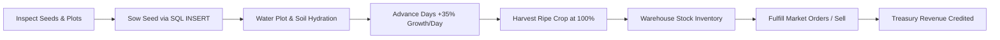

# 🌾 FARMDB — Complete Game Design, Visuals & 10-Level Story Master Report

**FARMDB** is an interactive, gamified 3D agricultural database simulation. Players learn and master relational database engineering (**SQL & SQLite**) by restoring, managing, and scaling an inherited family farmstead into a multi-regional agribusiness conglomerate.

---

## 📑 Table of Contents
1. [Executive Summary & Core Philosophy](#1-executive-summary--core-philosophy)
2. [Dual-Platform Architecture & Engine Specifications](#2-dual-platform-architecture--engine-specifications)
3. [Complete 3D World, Assets & Physics Inventory](#3-complete-3d-world-assets--physics-inventory)
4. [Atmospheric Simulation, Day/Night & Weather](#4-atmospheric-simulation-daynight--weather)
5. [Universal Farming Mechanics & Simulation Lifecycle](#5-universal-farming-mechanics--simulation-lifecycle)
6. [Complete Database Schema Architecture](#6-complete-database-schema-architecture)
7. [Master 10-Level Campaign & Story Breakdown](#7-master-10-level-campaign--story-breakdown)
   - [Level 1: The Empty Farm](#level-1-the-empty-farm)
   - [Level 2: First Harvest](#level-2-first-harvest)
   - [Level 3: The Farm Gets Busy](#level-3-the-farm-gets-busy)
   - [Level 4: The Supply Problem](#level-4-the-supply-problem)
   - [Level 5: The Market](#level-5-the-market)
   - [Level 6: Farm Manager](#level-6-farm-manager)
   - [Level 7: The Numbers Don't Match](#level-7-the-numbers-dont-match)
   - [Level 8: The Expansion](#level-8-the-expansion)
   - [Level 9: The Agricultural Empire](#level-9-the-agricultural-empire)
   - [Level 10: The Harvest Decision (Grand Finale)](#level-10-the-harvest-decision-grand-finale)
8. [Audio Engine & Procedural Sound FX](#8-audio-engine--procedural-sound-fx)
9. [Player Career Profile, Badges & Treasury](#9-player-career-profile-badges--treasury)
10. [Comprehensive Progression & Unlocks Matrix](#10-comprehensive-progression--unlocks-matrix)

---

## 1. Executive Summary & Core Philosophy

Traditional SQL learning platforms rely on static text outputs and abstract spreadsheets. **FARMDB** bridges the gap between database theory and visual reality by connecting every SQL statement directly to real-time 3D simulation mechanics:

* **Actions Have Consequences**: `INSERT` physical seeds into a table, and they appear in the warehouse; `UPDATE` crop status to planted, and sprout models emerge from the 3D soil.
* **Universal Agricultural Sandbox**: Sowing, watering, day advancement, growth cycles, harvesting, stock inventory, and market trading are **not locked to Level 2**—they remain active and reusable throughout the entire 10-level campaign.
* **Persistent Database Progression**: Tables created in earlier levels (`seeds`, `animals`, `plots`, `farming`, `stock`) persist into subsequent levels, evolving into complex multi-table enterprise architectures with `JOIN`s, `CTE`s, subqueries, and window functions.

---

## 2. Dual-Platform Architecture & Engine Specifications

FARMDB provides a synchronized experience across Desktop and Mobile form factors:

```
┌─────────────────────────────────────────────────────────────────────────────┐
│                            FARMDB CLIENT ENGINE                             │
├──────────────────────────────────────┬──────────────────────────────────────┤
│            DESKTOP CLIENT            │            MOBILE CLIENT             │
│  - Multi-panel productivity layout   │  - Touch-optimized responsive drawer │
│  - Resizable SQL code editor panel   │  - Bottom navigation sheet           │
│  - Real-time schema table explorer   │  - Compact Three.js viewport         │
│  - Floating farmer profile modal     │  - Gesture-based camera navigation   │
├──────────────────────────────────────┴──────────────────────────────────────┤
│                         SHARED CORE ARCHITECTURE                            │
│  • SQLite WebAssembly (sql.js) in-memory relational compiler                │
│  • Three.js WebGL rendering engine with PCFSoftShadowMap                    │
│  • Event-driven state synchronization between SQL & 3D scene graphs         │
│  • Web Audio API sound synthesis with persistent audio preferences          │
└─────────────────────────────────────────────────────────────────────────────┘
```

* **Desktop Client** (`/Desktop`): Full widescreen multi-column workspace with real-time 3D canvas, live schema inspector, SQL compiler with syntax highlighting, tabular results grid, and interactive toasts.
* **Mobile Client** (`/Mobile`): Touch-first UI featuring collapsible SQL drawers, swipeable query helpers, compact status badges, and pinch-to-zoom 3D camera controls.
* **SQL Engine**: Real-time SQLite WebAssembly engine running queries client-side with millisecond latency and robust syntax error recovery.

---

## 3. Complete 3D World, Assets & Physics Inventory

```
                                  ⛰️ Distant Mountain Ranges & Pine Forests 🌲
                                           🌀 Giant Modern Wind Turbine
        ┌────────────────────────────────────────────────────────────────────────────────────────┐
        │                                                                                        │
        │   🏡 Red Timber Barn & Silo       🌾 5 Major Crop Plots (10 Sub-Beds: A1.1 – A5.2)    │
        │   ├── Sliding Double Doors        ├── 🍅 Tomato Vines (Foliage & Ripening Fruits)      │
        │   ├── Hayloft & Weather Vane      ├── 🌾 Golden Wheat Stalks & Amber Grain             │
        │   └── 🐄 Pasture (Daisy & Bella)  ├── 🌿 Paddy Rice Shoots                             │
        │                                   └── 🌽 Tall Corn Stalks with Ripe Ears               │
        │   🚰 Water Reservoir (100k L)                                                          │
        │   ├── Translucent Water Volume    🚜 Equipment Yard & Tractor                          │
        │   ├── Glass Level Gauge           ├── 3D Old Red Tractor with Exhaust Smoke           │
        │   └── Bobbing Yellow Buoy         └── Animated Field Harvesting Driving Route          │
        │                                                                                        │
        │   🐕 2 German Shepherds           🚚 Logistics Depot & Delivery Flatbed Truck          │
        │   ├── FBX Skeleton Rigged         ├── Cargo Loading Bed & Sacks                        │
        │   └── 4 AI Motion States          └── Automated Delivery Entry from Country Road       │
        │                                                                                        │
        │   💨 Lattice Windpump             👨‍🌾 Uncle Somu (Mentor Character)                    │
        │   🐦 Bird Flocks (V-Formation)    💡 Interactive Illuminated Lamp Posts & Fireflies    │
        └────────────────────────────────────────────────────────────────────────────────────────┘
```

### A. Landscape, Countryside & River
* **Catmull-Rom Ribbon River**: Continuous parametric ribbon geometry with a submerged darker riverbed underlayer and animated water wave shaders, eliminating geometry gaps.
* **Procedural Countryside**: Rolling terrain with elevation variation, dirt access roads, gravel yard, and perimeter timber post-and-rail fencing.
* **Surrounding World**: Distant 3D pine forests, layered mountain ridges, and volumetric drifting clouds with soft shadows.

### B. Farm Plots & Procedural Crops
* **5 Major Field Columns (Plots A1 to A5)**:
  * Each plot is subdivided into **North Bed (.1)** and **South Bed (.2)**, providing **10 total sub-beds** (`A1.1` to `A5.2`).
  * Dynamic soil hydration shader (rich dark loam when watered, pale cracked earth when dry).
* **Procedural 3D Crop Types**:
  * **Tomatoes**: Leafy green vines with ripening spherical fruit clusters.
  * **Wheat**: Textured golden stalks with waving grain heads.
  * **Rice**: Lush green and golden paddy tufts.
  * **Corn**: Tall multi-leaf stalks with yellow corn ears.
* **5 Distinct Growth Stages**: `0%` (Tilled Bed), `25%` (Sprouts), `50%` (Vegetative), `75%` (Budding), `100%` (Harvestable).

### C. Buildings & Infrastructure
* **Red Timber Barn & Pasture**: American gambrel roof with white trims, metal feed silo, double sliding doors, hayloft, and animated rooster weather vane.
* **Water Reservoir**: Multi-tier stone and steel water tower with a translucent water volume that physically raises and lowers from `0` to `100,000 Liters`, complete with glass sight gauge and bobbing yellow buoy.
* **Tractor & Equipment Yard**: Vintage red tractor with large ribbed tires, front steering assembly, vertical exhaust pipe emitting translucent smoke particles, and animated harvest driving loops.
* **Windpump & Wind Turbine**:
  * Vintage steel lattice windpump spinning with ambient breeze.
  * Giant modern 3-blade commercial wind turbine situated on the distant eastern ridge.
* **Interactive Street Lamps**: Warm incandescent lanterns that automatically illuminate at dusk/night and can be clicked to toggle illumination.

### D. Living Fauna & Characters
* **Uncle Somu (Mentor)**: Animated 3D farmer wearing straw hat, denim overalls, and boots with idle breathing, greeting waves, and hoeing animations.
* **German Shepherd Dogs (Rocky & Bruno)**: Skeleton-rigged models with PBR textures and 4 AI state loops: *Idle Breathing*, *Bark/Play*, *Walk Patrol*, and *Running Trot*.
* **Cattle (Daisy & Bella)**: Procedural Holstein cows with spotted coats, grazing head dips, tail swishes, and interactive mooing sound effects.
* **Bird Flocks**: V-formation flocks soaring smoothly across the sky with corrected flight vector alignment (apex facing forward).

---

## 4. Atmospheric Simulation, Day/Night & Weather

The environment features a dynamic day/night lighting cycle and atmospheric weather:

* **Morning Golden Hour**: Warm 45° sun, soft amber shadows, awakening birds.
* **High Noon**: Bright overhead directional sunlight, vibrant saturated foliage.
* **Afternoon Amber**: Rich warm glow across fields.
* **Sunset Crimson**: Violet-orange horizon gradient with lengthening shadows.
* **Midnight Starlight**: Deep navy moonlight, glowing green fireflies, and automatic street lamp illumination.
* **Weather Modes**: Clear Sky, Sunny Heatwave, Overcast Mist, and Midnight Rainstorm with droplet splashes.

---

## 5. Universal Farming Mechanics & Simulation Lifecycle

Farming is a permanent, reusable sandbox engine throughout all levels:



### Key Simulation Rules:
1. **Sowing**: Inserting a record into `farming` and setting `plots.status = 'occupied'` physically places sprout models in the 3D world.
2. **Water Consumption**: Each active plot consumes **400 Liters** of water per day from the reservoir.
3. **Growth Dynamics**: Clicking **Advance Day** increments crop growth by **+35%** per day. At `100%`, the crop matures into full harvestable models.
4. **Harvesting**: Executing a harvest SQL query triggers the red tractor driving animation, converts crops into warehouse crates, frees the plot to `available`, and adds kilograms to `stock`.
5. **Commercial Selling**: Deducting stock via `UPDATE` or `DELETE` executes sale contracts and credits cash to the treasury.

---

## 6. Complete Database Schema Architecture

The relational schema expands progressively across the 10 levels:

```
┌──────────────────┐       ┌──────────────────────┐       ┌──────────────────┐
│      plots       │       │       farming        │       │      seeds       │
├──────────────────┤       ├──────────────────────┤       ├──────────────────┤
│ plot_id (PK)     │◄──┐   │ farm_id (PK)         │   ┌──►│ seed_id (PK)     │
│ plot_name        │   └───┼ plot_id (FK)         │   │   │ seed_name        │
│ sub_bed          │       │ crop_name            │───┘   │ quantity         │
│ status           │       │ stage / growth_pct   │       │ price            │
│ soil_moisture    │       │ planted_date         │       └──────────────────┘
└──────────────────┘       └──────────────────────┘
         ▲                            ▲
         │                            │
┌──────────────────┐       ┌──────────────────────┐       ┌──────────────────┐
│   assignments    │       │        stock         │       │      orders      │
├──────────────────┤       ├──────────────────────┤       ├──────────────────┤
│ assignment_id(PK)│       │ item_id (PK)         │       │ order_id (PK)    │
│ worker_id (FK)───┼──┐    │ product_name         │◄──────┼ product_name     │
│ plot_id (FK)─────┘  │    │ quantity             │       │ customer_name    │
│ shift            │  │    │ price                │       │ quantity_kg      │
└──────────────────┘  │    └──────────────────────┘       │ status           │
                      │                                   └──────────────────┘
                      ▼
           ┌──────────────────────┐       ┌──────────────────────────────────┐
           │       workers        │       │         drought_metrics          │
           ├──────────────────────┤       ├──────────────────────────────────┤
           │ worker_id (PK)       │       │ crop_name (PK)                   │
           │ name                 │       │ water_liters_per_kg              │
           │ role                 │       │ expected_market_price            │
           │ salary               │       │ cultivation_cost                 │
           └──────────────────────┘       └──────────────────────────────────┘
```

---

## 7. Master 10-Level Campaign & Story Breakdown

---

### Level 1: THE EMPTY FARM
* **Role**: New Farmer
* **SQL Focus**: `CREATE TABLE`, `INSERT INTO`, `SELECT *`
* **Plot Scope**: Plot A1 (`A1.1` & `A1.2`)
* **Story Narrative**: You arrive at your grandfather's overgrown homestead. Uncle Somu hands you an old ledger with inventory records and teaches you how to structure them into SQLite.
* **Missions**:
  1. `L1_M0`: **Create Seeds Table**
     ```sql
     CREATE TABLE seeds (seed_id INTEGER PRIMARY KEY, seed_name TEXT, quantity INTEGER, price INTEGER);
     ```
  2. `L1_M1`: **Register Starting Seeds**
     ```sql
     INSERT INTO seeds VALUES (1, 'Tomato', 10, 20), (2, 'Rice', 15, 15), (3, 'Wheat', 20, 12);
     ```
  3. `L1_M2`: **Inspect Seed Inventory**
     ```sql
     SELECT * FROM seeds;
     ```
  4. `L1_M3`: **Register Barn Animals**
     ```sql
     CREATE TABLE animals (animal_id INTEGER PRIMARY KEY, name TEXT, species TEXT, age INTEGER);
     INSERT INTO animals VALUES (1, 'Daisy', 'Cow', 4), (2, 'Bella', 'Cow', 3);
     ```
  5. `L1_M4`: **Inspect Livestock**
     ```sql
     SELECT * FROM animals;
     ```
  6. `L1_M5`: **Register Farm Tractor**
     ```sql
     CREATE TABLE equipment (equip_id INTEGER PRIMARY KEY, item_name TEXT, condition TEXT);
     INSERT INTO equipment VALUES (1, 'Old Red Tractor', 'Good');
     ```
* **Visual Outcome**: 3D Barn unlocks, Daisy & Bella graze in pasture, Old Red Tractor appears on parking pad.
* **Rewards**: 🏷️ *Database Farmer* Badge, 45 Seeds, 2 Cows, 1 Tractor, +100 XP.

---

### Level 2: FIRST HARVEST
* **Role**: Farmer
* **SQL Focus**: `WHERE`, `UPDATE`, `INSERT`, Day Progression
* **Plot Scope**: Plot A1
* **Story Narrative**: Starting funds will run out without a successful harvest. You find available land, sow tomato seeds, water them across days, harvest 40kg of ripe produce, and sell it at the market.
* **Missions**:
  1. `L2_M0`: **Find Available Plots**
     ```sql
     SELECT * FROM plots WHERE status = 'available';
     ```
  2. `L2_M1`: **Check Tomato Seed Stock**
     ```sql
     SELECT * FROM seeds WHERE seed_name = 'Tomato';
     ```
  3. `L2_M2`: **Plant Tomato in Plot A1**
     ```sql
     INSERT INTO farming (farm_id, plot_id, crop_name, stage, growth_pct) VALUES (1, 1, 'Tomato', 'Planted', 0);
     UPDATE plots SET status = 'occupied' WHERE plot_id = 1;
     UPDATE seeds SET quantity = quantity - 1 WHERE seed_name = 'Tomato';
     ```
  4. `L2_M3`: **Nurture Crop to Maturity**
     *Advance Days until growth reaches 100%.*
  5. `L2_M4`: **Harvest Ripe Tomatoes**
     ```sql
     UPDATE farming SET stage = 'Harvested' WHERE plot_id = 1;
     UPDATE plots SET status = 'available' WHERE plot_id = 1;
     INSERT INTO stock (item_id, product_name, quantity, price) VALUES (1, 'Tomato', 40, 20);
     ```
  6. `L2_M5`: **Sell Produce at Town Market**
     ```sql
     UPDATE stock SET quantity = quantity - 40 WHERE product_name = 'Tomato';
     ```
* **Visual Outcome**: Tomato sprouts emerge, grow into fruiting vines, tractor harvests rows, and cash arrives in treasury.
* **Rewards**: 🌾 *Harvest Master* Badge, +₹800 Revenue, Cash Balance ₹1,300, +150 XP.

---

### Level 3: THE FARM GETS BUSY
* **Role**: Farm Operator
* **SQL Focus**: `ORDER BY`, `GROUP BY`, Aggregates (`COUNT`, `SUM`, `AVG`), `HAVING`
* **Plot Scope**: Plot A2 Unlocks (4 active sub-beds across A1 & A2)
* **Story Narrative**: Revenue from your first harvest unlocks Plot A2. With Wheat, Rice, Corn, and Tomatoes flowing into storage, SQL analytics are required to prioritize high-yield crops.
* **Missions**:
  1. `L3_M0`: **Verify Unlocked Plot A2**
     ```sql
     SELECT * FROM plots WHERE status = 'available';
     ```
  2. `L3_M1`: **Stock Multi-Crop Harvest Batch**
     ```sql
     INSERT INTO stock VALUES (2, 'Wheat', 80, 15), (3, 'Rice', 120, 25), (4, 'Corn', 60, 18), (5, 'Tomato', 90, 20);
     ```
  3. `L3_M2`: **Sort Warehouse Inventory by Quantity**
     ```sql
     SELECT * FROM stock ORDER BY quantity DESC;
     ```
  4. `L3_M3`: **Calculate Inventory Totals & Averages**
     ```sql
     SELECT COUNT(*), SUM(quantity), AVG(price) FROM stock;
     ```
  5. `L3_M4`: **Group Harvest by Crop Variety**
     ```sql
     SELECT product_name, SUM(quantity), AVG(price) FROM stock GROUP BY product_name;
     ```
  6. `L3_M5`: **Filter High-Yield Crops with HAVING**
     ```sql
     SELECT product_name, SUM(quantity) FROM stock GROUP BY product_name HAVING SUM(quantity) >= 80;
     ```
* **Visual Outcome**: Multi-crop crates stack in the storage shed; Plot A2 fencing opens for cultivation.
* **Rewards**: 📊 *Yield Analyst* Badge, 350kg Yield Cataloged, +₹1,500 Cash Bonus, +200 XP.

---

### Level 4: THE SUPPLY PROBLEM
* **Role**: Supply Manager
* **SQL Focus**: `AND`, `OR`, `IN`, `BETWEEN`, `LIKE`, `CASE WHEN`, `IS NULL`
* **Plot Scope**: Plot A3 Unlocks (6 active sub-beds)
* **Story Narrative**: Expanding acreage creates fertilizer and organic seed shortages. You build a supplier directory and an automated stock triage classifier.
* **Missions**:
  1. `L4_M0`: **Create Supply Management Tables**
     ```sql
     CREATE TABLE suppliers (supplier_id INTEGER PRIMARY KEY, supplier_name TEXT, contact TEXT);
     CREATE TABLE supplies (supply_id INTEGER PRIMARY KEY, supplier_id INTEGER, item_name TEXT, category TEXT, stock_level INTEGER, reorder_level INTEGER, unit_cost INTEGER);
     ```
  2. `L4_M1`: **Seed Suppliers & Stock Records**
     ```sql
     INSERT INTO suppliers VALUES (1, 'AgroCorp Direct', '555-0101'), (2, 'BioFert Organics', '555-0102'), (3, 'GreenValley Seeds', '555-0103');
     INSERT INTO supplies VALUES (101, 1, 'Standard NPK Fertilizer', 'Fertilizer', 5, 20, 350), (102, 2, 'Organic Compost Mix', 'Organic Fertilizer', 12, 15, 450), (103, 3, 'Hybrid Tomato Seeds F1', 'Seeds', 8, 25, 220), (104, 3, 'Golden Corn Seeds', 'Seeds', 40, 10, 180), (105, 1, 'Heavy Duty Drip Pipe', 'Irrigation', 15, 10, 800), (106, 2, 'Organic Bio-Pesticide', 'Organic Pest Control', 3, 10, 600);
     ```
  3. `L4_M2`: **Find Low-Stock Items**
     ```sql
     SELECT * FROM supplies WHERE stock_level <= reorder_level AND unit_cost <= 500;
     ```
  4. `L4_M3`: **Target Key Categories with IN & BETWEEN**
     ```sql
     SELECT * FROM supplies WHERE category IN ('Fertilizer', 'Seeds') AND unit_cost BETWEEN 200 AND 500;
     ```
  5. `L4_M4`: **Find Organic Supplies with LIKE**
     ```sql
     SELECT * FROM supplies WHERE item_name LIKE '%Organic%' OR category LIKE '%Organic%';
     ```
  6. `L4_M5`: **Triage Inventory with CASE WHEN**
     ```sql
     SELECT item_name, category, stock_level, CASE WHEN stock_level <= reorder_level THEN 'Reorder Needed' ELSE 'Sufficient' END AS stock_status FROM supplies;
     ```
* **Visual Outcome**: Supply depot area builds out with wooden crates, fertilizer bags, and barrels.
* **Rewards**: 📦 *Supply Chain Master* Badge, +₹2,000 Cash Bonus, +250 XP.

---

### Level 5: THE MARKET
* **Role**: Market Seller
* **SQL Focus**: Date Functions (`date('now')`), Calculated Fields, Commercial Orders
* **Plot Scope**: Plot A4 Unlocks (8 active sub-beds)
* **Story Narrative**: City restaurants (Italian Bistro, Curry House, Bakery) place wholesale purchase contracts with 7-day expiration limits.
* **Missions**:
  1. `L5_M0`: **Create Market & Orders Tables**
     ```sql
     CREATE TABLE market_prices (crop_name TEXT PRIMARY KEY, current_price INTEGER, updated_at TEXT);
     CREATE TABLE orders (order_id INTEGER PRIMARY KEY, customer_name TEXT, product_name TEXT, quantity_kg INTEGER, unit_price INTEGER, status TEXT, order_date TEXT);
     ```
  2. `L5_M1`: **Record Inbound Purchase Contracts**
     ```sql
     INSERT INTO market_prices VALUES ('Tomato', 25, date('now')), ('Wheat', 18, date('now')), ('Rice', 30, date('now'));
     INSERT INTO orders VALUES (1, 'Luigi Italian Bistro', 'Tomato', 50, 25, 'pending', date('now')), (2, 'Golden Grain Bakery', 'Wheat', 80, 18, 'pending', date('now', '-2 days')), (3, 'Taj Curry House', 'Rice', 100, 30, 'pending', date('now', '-5 days')), (4, 'Old Harbour Diner', 'Tomato', 20, 22, 'fulfilled', date('now', '-10 days'));
     ```
  3. `L5_M2`: **Compute Total Order Valuations**
     ```sql
     SELECT customer_name, product_name, quantity_kg, unit_price, (quantity_kg * unit_price) AS total_revenue FROM orders;
     ```
  4. `L5_M3`: **Filter Active Orders within 7 Days**
     ```sql
     SELECT * FROM orders WHERE status = 'pending' AND date(order_date) >= date('now', '-7 days');
     ```
  5. `L5_M4`: **Fulfill Chef Luigi's Order**
     ```sql
     UPDATE orders SET status = 'fulfilled' WHERE order_id = 1;
     ```
* **Visual Outcome**: Vintage green flatbed delivery truck drives onto the farm road, loads crates, and departs.
* **Rewards**: 🏷️ *Market Mogul* Badge, +₹3,500 Cash Bonus, +300 XP.

---

### Level 6: FARM MANAGER
* **Role**: Farm Manager
* **SQL Focus**: Foreign Keys, `INNER JOIN`, `LEFT JOIN`, Auditing NULLs
* **Plot Scope**: Plot A5 Unlocks (**100% of all 5 major plots / 10 sub-beds unlocked**)
* **Story Narrative**: The farm reaches full acreage. You recruit 4 agricultural specialists and coordinate plot and machinery shifts using relational joins.
* **Missions**:
  1. `L6_M0`: **Create Workforce Schema**
     ```sql
     CREATE TABLE workers (worker_id INTEGER PRIMARY KEY, name TEXT, role TEXT, salary INTEGER);
     CREATE TABLE assignments (assignment_id INTEGER PRIMARY KEY, worker_id INTEGER, plot_id INTEGER, shift TEXT);
     ```
  2. `L6_M1`: **Recruit Agricultural Specialists**
     ```sql
     INSERT INTO workers VALUES (1, 'Ravi Kumar', 'Agronomist', 3500), (2, 'Maya Sharma', 'Irrigation Lead', 3200), (3, 'Arjun Singh', 'Machinery Operator', 3000), (4, 'Priya Patel', 'Crop Inspector', 2800);
     ```
  3. `L6_M2`: **Assign Duty Shifts**
     ```sql
     INSERT INTO assignments VALUES (101, 1, 1, 'Morning'), (102, 2, 2, 'Morning'), (103, 3, 3, 'Afternoon');
     ```
  4. `L6_M3`: **Generate Master Roster with INNER JOIN**
     ```sql
     SELECT workers.name, workers.role, assignments.plot_id, assignments.shift FROM workers INNER JOIN assignments ON workers.worker_id = assignments.worker_id;
     ```
  5. `L6_M4`: **Audit Unassigned Staff with LEFT JOIN**
     ```sql
     SELECT workers.name, workers.role FROM workers LEFT JOIN assignments ON workers.worker_id = assignments.worker_id WHERE assignments.assignment_id IS NULL;
     ```
* **Visual Outcome**: Animated crew members appear near plots; all 10 sub-beds active.
* **Rewards**: 👔 *General Farm Manager* Badge, +₹4,500 Cash Bonus, +350 XP.

---

### Level 7: THE NUMBERS DON'T MATCH
* **Role**: Financial Auditor
* **SQL Focus**: Scalar Subqueries, `NOT IN`, Correlated Subqueries with `NOT EXISTS`, `DELETE`
* **Plot Scope**: All 5 Plots
* **Story Narrative**: A midnight audit reveals a ₹49,000 cash discrepancy. Forensic SQL subqueries are used to isolate and eliminate unauthorized charges.
* **Missions**:
  1. `L7_M0`: **Create Audit Schema**
     ```sql
     CREATE TABLE approved_budgets (category TEXT PRIMARY KEY, max_allowed INTEGER);
     CREATE TABLE expenses (expense_id INTEGER PRIMARY KEY, category TEXT, description TEXT, amount INTEGER);
     INSERT INTO approved_budgets VALUES ('Seeds', 5000), ('Fertilizer', 8000), ('Fuel', 6000), ('Maintenance', 10000);
     INSERT INTO expenses VALUES (1, 'Seeds', 'F1 Tomato Seeds Batch', 4200), (2, 'Fertilizer', 'Bulk NPK Delivery', 7500), (3, 'Fuel', 'Tractor Diesel 500L', 5200), (4, 'Luxury Drone', 'VIP Gold Surveillance Drone', 49000), (5, 'Maintenance', 'Pump Valve Replacement', 3100);
     ```
  2. `L7_M1`: **Detect Expenses Above Average**
     ```sql
     SELECT * FROM expenses WHERE amount > (SELECT AVG(amount) FROM expenses);
     ```
  3. `L7_M2`: **Find Unauthorized Categories with NOT IN**
     ```sql
     SELECT * FROM expenses WHERE category NOT IN (SELECT category FROM approved_budgets);
     ```
  4. `L7_M3`: **Verify Violation with NOT EXISTS**
     ```sql
     SELECT * FROM expenses e WHERE NOT EXISTS (SELECT 1 FROM approved_budgets b WHERE b.category = e.category AND e.amount <= b.max_allowed);
     ```
  5. `L7_M4`: **Expunge Fraudulent Charge**
     ```sql
     DELETE FROM expenses WHERE expense_id = 4;
     ```
* **Visual Outcome**: Midnight rain storm clears into moonlight; ledger balances to exact zero discrepancy.
* **Rewards**: 🔍 *Forensic Auditor* Badge, +₹5,000 Cash Bonus, +400 XP.

---

### Level 8: THE EXPANSION
* **Role**: Expansion Director
* **SQL Focus**: Common Table Expressions (`WITH CTE`), Chained CTEs, Multi-Facility Benchmarking
* **Plot Scope**: Regional Multi-Farm Network (83 Total Acres)
* **Story Narrative**: FARMDB expands across 4 regional branches (Home Farm, Farm North, Farm South, Farm East). CTEs provide modular, readable enterprise analytics.
* **Missions**:
  1. `L8_M0`: **Create Regional Enterprise Schema**
     ```sql
     CREATE TABLE facilities (facility_id INTEGER PRIMARY KEY, facility_name TEXT, region TEXT, acreage INTEGER);
     CREATE TABLE regional_production (record_id INTEGER PRIMARY KEY, facility_id INTEGER, crop_name TEXT, yield_tons REAL, production_cost INTEGER);
     INSERT INTO facilities VALUES (1, 'Home Homestead', 'Valley Core', 20), (2, 'North Riverlands', 'North Basin', 25), (3, 'South Plains Farm', 'South Prairie', 18), (4, 'East Hill Orchards', 'East Ridge', 20);
     INSERT INTO regional_production VALUES (1, 1, 'Tomato', 42.5, 12000), (2, 1, 'Wheat', 38.0, 9500), (3, 2, 'Rice', 55.0, 16000), (4, 2, 'Corn', 48.2, 13200), (5, 3, 'Wheat', 32.0, 8800), (6, 3, 'Corn', 29.5, 8100), (7, 4, 'Apple', 45.0, 15000), (8, 4, 'Tomato', 36.8, 11000);
     ```
  2. `L8_M1`: **Summarize Facility Output with WITH CTE**
     ```sql
     WITH FacilityYields AS (SELECT facility_id, SUM(yield_tons) AS total_tons, SUM(production_cost) AS total_cost FROM regional_production GROUP BY facility_id) SELECT * FROM FacilityYields WHERE total_tons > 35;
     ```
  3. `L8_M2`: **Benchmark Above-Average Facilities with Chained CTEs**
     ```sql
     WITH FacilityTotals AS (SELECT facility_id, SUM(yield_tons) AS total_tons FROM regional_production GROUP BY facility_id), EnterpriseAvg AS (SELECT AVG(total_tons) AS avg_tons FROM FacilityTotals) SELECT f.facility_id, f.total_tons, e.avg_tons FROM FacilityTotals f, EnterpriseAvg e WHERE f.total_tons >= e.avg_tons;
     ```
  4. `L8_M3`: **Analyze Unit Cost Efficiency (Cost per Ton)**
     ```sql
     WITH UnitCostCTE AS (SELECT facility_id, ROUND(SUM(production_cost)/SUM(yield_tons), 2) AS cost_per_ton FROM regional_production GROUP BY facility_id) SELECT * FROM UnitCostCTE ORDER BY cost_per_ton ASC;
     ```
* **Visual Outcome**: Modern 3-blade wind turbine activates on the distant ridge; regional map HUD activates.
* **Rewards**: 🌐 *Regional Director* Badge, 4 Facilities Managed, +₹7,000 Cash Bonus, +450 XP.

---

### Level 9: THE AGRICULTURAL EMPIRE
* **Role**: Agribusiness Executive
* **SQL Focus**: Window Functions (`SUM() OVER ()`, `RANK() OVER (PARTITION BY ...)`), `ROW_NUMBER()`
* **Plot Scope**: Statewide Agribusiness Scope
* **Story Narrative**: The farm evolves into a statewide corporation. Window functions compute running cash flows and crop rankings without collapsing detailed records.
* **Missions**:
  1. `L9_M0`: **Create Enterprise Revenue Ledger**
     ```sql
     CREATE TABLE empire_revenue (record_id INTEGER PRIMARY KEY, division TEXT, month_num INTEGER, monthly_revenue INTEGER);
     INSERT INTO empire_revenue VALUES (1, 'Valley Division', 1, 45000), (2, 'Valley Division', 2, 52000), (3, 'Valley Division', 3, 61000), (4, 'Northern Division', 1, 38000), (5, 'Northern Division', 2, 44000), (6, 'Northern Division', 3, 58000), (7, 'Southern Division', 1, 30000), (8, 'Southern Division', 2, 36000), (9, 'Southern Division', 3, 42000);
     ```
  2. `L9_M1`: **Compute Running Cumulative Revenue**
     ```sql
     SELECT record_id, division, month_num, monthly_revenue, SUM(monthly_revenue) OVER (ORDER BY record_id) AS running_total FROM empire_revenue;
     ```
  3. `L9_M2`: **Rank Crops per Facility with RANK()**
     ```sql
     SELECT record_id, facility_id, crop_name, yield_tons, RANK() OVER (PARTITION BY facility_id ORDER BY yield_tons DESC) AS yield_rank FROM regional_production;
     ```
  4. `L9_M3`: **Extract Top Performer per Branch with ROW_NUMBER()**
     ```sql
     WITH RankedCrops AS (SELECT record_id, facility_id, crop_name, yield_tons, ROW_NUMBER() OVER (PARTITION BY facility_id ORDER BY yield_tons DESC) AS rn FROM regional_production) SELECT * FROM RankedCrops WHERE rn = 1;
     ```
  5. `L9_M4`: **Partitioned Running Revenue by Division**
     ```sql
     SELECT record_id, division, month_num, monthly_revenue, SUM(monthly_revenue) OVER (PARTITION BY division ORDER BY month_num) AS division_running_total FROM empire_revenue;
     ```
* **Visual Outcome**: Modern executive UI styling; animated real-time revenue trendlines.
* **Rewards**: 👑 *Agribusiness Executive* Badge, +₹10,000 Cash Bonus, +500 XP.

---

### Level 10: THE HARVEST DECISION (GRAND FINALE)
* **Role**: Farm CEO
* **SQL Focus**: Strategic Relational Synthesis (`JOIN` + `CTE` + `Aggregates` + `CASE`) under Critical Drought
* **Plot Scope**: All 10 Sub-Beds under Severe Water Rationing
* **Story Narrative**: A regional drought threatens the state. Canal gates are locked and only 18,000L of water remain in the reservoir. You synthesize water consumption, expected market prices, and margins to allocate irrigation quotas and lead the farm to total victory.
* **Missions**:
  1. `L10_M0`: **Model Drought Telemetry & Resource Costs**
     ```sql
     CREATE TABLE drought_metrics (crop_name TEXT PRIMARY KEY, water_liters_per_kg INTEGER, expected_market_price INTEGER, cultivation_cost INTEGER);
     INSERT INTO drought_metrics VALUES ('Tomato', 20, 35, 12), ('Wheat', 15, 24, 8), ('Rice', 65, 32, 14), ('Corn', 30, 22, 10);
     ```
  2. `L10_M1`: **Calculate Profit Margin per Liter of Water**
     ```sql
     WITH WaterEfficiency AS (SELECT crop_name, water_liters_per_kg, (expected_market_price - cultivation_cost) AS net_margin, ROUND(CAST(expected_market_price - cultivation_cost AS REAL) / water_liters_per_kg, 2) AS profit_per_liter FROM drought_metrics) SELECT * FROM WaterEfficiency ORDER BY profit_per_liter DESC;
     ```
  3. `L10_M2`: **Allocate Emergency Water Quotas with CASE**
     ```sql
     SELECT crop_name, water_liters_per_kg, CASE WHEN water_liters_per_kg <= 20 THEN 'Priority Full Irrigation' WHEN water_liters_per_kg <= 35 THEN 'Rationed Half Irrigation' ELSE 'Fallow / No Water' END AS drought_strategy FROM drought_metrics;
     ```
  4. `L10_M3`: **Value Emergency Warehouse Reserves with INNER JOIN**
     ```sql
     SELECT s.product_name, s.quantity, d.expected_market_price, (s.quantity * d.expected_market_price) AS crisis_value FROM stock s INNER JOIN drought_metrics d ON LOWER(s.product_name) = LOWER(d.crop_name);
     ```
  5. `L10_M4`: **The Sovereign Victory Resolution**
     ```sql
     SELECT 'FARMDB EMPIRE SURVIVED & TRIUMPHED' AS status, SUM(s.quantity * d.expected_market_price) AS final_treasury_revenue FROM stock s INNER JOIN drought_metrics d ON LOWER(s.product_name) = LOWER(d.crop_name);
     ```
* **Visual Outcome**: Golden harvest aura, reservoir refills, golden celebration fireworks across 3D sky.
* **Rewards**: 🏆 *Agribusiness Emperor* Badge, Grand Sovereign Victory, +₹25,000 Cash Grant, +1,000 XP.

---

## 8. Audio Engine & Procedural Sound FX

* **Audio State**: Defaults to **UNMUTED** with user preference saved in `localStorage` (`farmdb_audio_muted`).
* **Synthesized Web Audio API Palette**:
  - `water_plop`: Synthesized resonant sine-wave splash when watering plots.
  - `tractor_engine`: Low-frequency oscillator rumble during tractor plowing and harvesting.
  - `harvest_chime`: Ascending major triad chord upon successful mission completion.
  - `cow_moo` & `dog_bark`: Spatial audio triggered on animal clicks.
  - `bird_ambient`: Periodic procedural bird chirping in morning and day cycles.

---

## 9. Player Career Profile, Badges & Treasury

Clicking the farmer avatar or the top level pill opens the **Farmer Career Profile Modal**:

* **Treasury Cash**: Live dynamic rupee balance updating with sales, harvests, and mission rewards.
* **Active Cultivation**: Real-time counter of sown sub-beds (`0/10`).
* **Reservoir Reserves**: Live capacity indicator (`0 – 100,000 L`).
* **SQLite Database Engine**: Total table and record counts currently stored in WebAssembly memory.
* **Career Achievements & Badges**:
  - 🏷️ *Database Farmer* (Level 1)
  - 🌾 *Harvest Master* (Level 2)
  - 📊 *Yield Analyst* (Level 3)
  - 📦 *Supply Chain Master* (Level 4)
  - 🏷️ *Market Mogul* (Level 5)
  - 👔 *General Farm Manager* (Level 6)
  - 🔍 *Forensic Auditor* (Level 7)
  - 🌐 *Regional Director* (Level 8)
  - 👑 *Agribusiness Executive* (Level 9)
  - 🏆 *Agribusiness Emperor* (Level 10)

---

## 10. Comprehensive Progression & Unlocks Matrix

| Level | Chapter Title | Acreage & Plots | Unlocked 3D / Gameplay Asset | Key SQL Competencies |
| :---: | :--- | :---: | :--- | :--- |
| **1** | **The Empty Farm** | Plot A1 (A1.1, A1.2) | 3D Barn, 2 Cows, Tractor Pad, Seeds Shed | `CREATE TABLE`, `INSERT`, `SELECT` |
| **2** | **First Harvest** | Plot A1 | 3D Crop Growth Stages, Tractor Harvest Driving Route | `WHERE`, `UPDATE`, Agricultural Day Advancement |
| **3** | **The Farm Gets Busy** | Plot A2 Unlocked | Multi-Crop 3D Models (Tomato, Wheat, Rice, Corn) | `ORDER BY`, `GROUP BY`, `SUM`, `HAVING` |
| **4** | **The Supply Problem** | Plot A3 Unlocked | Logistics Supply Depot, Sacks & Barrels | `AND/OR`, `IN`, `BETWEEN`, `LIKE`, `CASE` |
| **5** | **The Market** | Plot A4 Unlocked | Vintage Green Delivery Flatbed Truck & Road Drive-in | `date('now')`, Arithmetic Calculated Fields |
| **6** | **Farm Manager** | Plot A5 (**100% Unlocked**) | 4 Specialized Crew Members & Duty Roster | `INNER JOIN`, `LEFT JOIN`, Relational Schemas |
| **7** | **The Numbers Don't Match** | All 5 Plots | Midnight Rain Atmospheric Mode & Audit Ledgers | Subqueries, `NOT IN`, `NOT EXISTS`, `DELETE` |
| **8** | **The Expansion** | 4 Regional Farms | Regional Agribusiness Map & Modern Wind Turbine | `WITH` Common Table Expressions (CTEs) |
| **9** | **Agricultural Empire** | Statewide Scope | Executive Suite Dashboard & Division Analytics | `RANK()`, `ROW_NUMBER()`, `OVER (PARTITION BY)` |
| **10** | **The Harvest Decision** | Drought Mode | Crisis Reservoir Physics & Sovereign Victory | Full Relational Strategic Synthesis |

---
*FARMDB — Built with Three.js, SQLite WebAssembly, and Web Audio API.*
