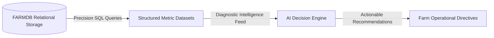

# FARMDB Player & SQL Reference Manual

> *"Cultivate Data. Grow Possibilities."* 🌱

Welcome to **FARMDB**, the interactive, narrative-driven agricultural SQL learning game. You arrive at a neglected countryside farm whose operational records, inventory, and field systems are incomplete. By mastering SQL from the ground up, you will restore and expand the farm, progressing from a **Farm Assistant** to a **Farm Business Owner**.

---

## Table of Contents
1. [Welcome to FARMDB](#1-welcome-to-farmdb)
2. [How the Game Works](#2-how-the-game-works)
3. [Normal/DA vs Full Stack Paths](#3-normalda-vs-full-stack-paths)
4. [Database Basics](#4-database-basics)
5. [Tables, Rows and Columns](#5-tables-rows-and-columns)
6. [Data Types](#6-data-types)
7. [PRIMARY KEY](#7-primary-key)
8. [FOREIGN KEY](#8-foreign-key)
9. [INSERT / SELECT](#9-insert--select)
10. [WHERE / ORDER BY / LIMIT](#10-where--order-by--limit)
11. [UPDATE / DELETE](#11-update--delete)
12. [GROUP BY / Aggregation](#12-group-by--aggregation)
13. [HAVING](#13-having)
14. [AND / OR / IN / BETWEEN / LIKE](#14-and--or--in--between--like)
15. [JOINs (INNER, LEFT, RIGHT, FULL)](#15-joins)
16. [NULL Handling](#16-null-handling)
17. [CASE Statements](#17-case-statements)
18. [Subqueries & Correlated Subqueries](#18-subqueries)
19. [Common Table Expressions (CTE / WITH)](#19-cte--with)
20. [Database Design & DDL (ALTER, DROP)](#20-database-design)
21. [Table Relationships (1:1, 1:M, M:M)](#21-table-relationships)
22. [Entity-Relationship (ER) Diagrams](#22-er-diagrams)
23. [Database Normalization](#23-database-normalization)
24. [Full Stack Advanced Topics](#24-full-stack-topics)

---

## 1. Welcome to FARMDB

In FARMDB, SQL is not just abstract syntax—it is your operational tool to run a living farm. Every query you execute has tangible consequences: crops sprout, warehouse inventory updates, cattle are tracked, and markets are supplied.

### Career Progression:
- 👨‍🌾 **Farm Assistant** (Foundation & Data Entry)
- 📊 **Data Analyst** (Filtering, Sorting & Summary)
- 🌾 **Farm Data Analyst** (Joins, Trends & Yield Optimization)
- 🗄️ **Database / System Manager** (Architecture, Schemas & Integrity)
- 🏆 **Farm Business Owner** (Full Stack Automation & Crisis Strategy)

---

## 2. How the Game Works

- **Living 3D & 2D Farm World**: Visualizes your fields (Plots A1–A5), warehouse, livestock barn, water reservoir, and equipment.
- **SQLite Engine**: Real in-browser database engine executing genuine SQL.
- **SQL Studio Compiler**: Built-in editor with 3-tier hints, table schema explorer, line numbers, and instant diagnostics.
- **Story Chapters**: Guided by Grandfather's worn notebook entries and Uncle Somu's advice to solve actual farm challenges.

---

## 3. Normal/DA vs Full Stack Paths

FARMDB provides two tracks tailored to your learning goals:

| Feature | Normal / Data Analytics Track | Full Stack Track |
| :--- | :--- | :--- |
| **Foundation Levels (1–16)** | Shared identical farm database | Shared identical farm database |
| **DA Final (Level 17)** | Complete Farm Data Analyst Capstone | Continues past Level 17 |
| **Advanced System Levels (18–24)** | — | Views, Transactions, Triggers, Procedures, DCL, AI & Drought Crisis |
| **Culmination Title** | **Farm Data Analyst** | **Farm Business Owner** |

---

## 4. Database Basics

A **database** is an organized container for storing, retrieving, and managing related information.

```sql
-- Creating and selecting a database
CREATE DATABASE farm_db;
USE farm_db;
```

---

## 5. Tables, Rows and Columns

- **Table**: A structured collection of data about a specific farm subject (e.g., `seeds`, `animals`, `plots`).
- **Column (Attribute)**: A specific piece of information (e.g., `seed_name`, `quantity`, `price`).
- **Row (Record / Tuple)**: A single complete entry across all columns.

```sql
CREATE TABLE seeds (
  seed_id INTEGER PRIMARY KEY,
  seed_name TEXT,
  quantity INTEGER,
  price INTEGER
);
```

---

## 6. Data Types

Data types define the kind of value each column can hold:

- `INTEGER`: Whole numbers (counts, IDs, quantities, prices in cents/rupees). Example: `10`, `500`.
- `TEXT` / `VARCHAR`: Alphanumeric text strings. Example: `'Tomato'`, `'Plot A1'`.
- `REAL` / `DECIMAL` / `FLOAT`: Fractional decimal numbers. Example: `3.14`, `12.50`.
- `DATE` / `DATETIME`: Calendar dates and timestamps. Example: `'2026-09-23'`.
- `BOOLEAN`: True/False flags (`1` or `0` in SQLite).

---

## 7. PRIMARY KEY

> **Definition**: A column (or set of columns) that **uniquely identifies** every individual record in a table.

- Ensures no duplicate rows exist.
- Cannot contain `NULL` values.
- Allows other tables to reliably reference this specific row.

```sql
-- seed_id uniquely identifies each seed bag in the warehouse
CREATE TABLE seeds (
  seed_id INTEGER PRIMARY KEY,
  seed_name TEXT NOT NULL,
  quantity INTEGER
);
```

---

## 8. FOREIGN KEY

> **Definition**: A column that **connects a record in one table to the PRIMARY KEY of another table**.

- Establishes relational links between different farm operational entities.
- Ensures data integrity (you cannot record livestock feeding for an animal that doesn't exist).

```sql
-- animal_id references the PRIMARY KEY of the animals table
CREATE TABLE feed_log (
  feed_id INTEGER PRIMARY KEY,
  animal_id INTEGER,
  feed_type TEXT,
  amount_kg INTEGER,
  FOREIGN KEY (animal_id) REFERENCES animals(animal_id)
);
```

---

## 9. INSERT / SELECT

- **`INSERT INTO`**: Adds new rows to a table.
- **`SELECT`**: Retrieves rows and columns from one or more tables.

```sql
-- Insert multiple records
INSERT INTO seeds (seed_id, seed_name, quantity, price) VALUES 
(1, 'Tomato', 10, 20),
(2, 'Rice', 15, 15),
(3, 'Wheat', 20, 12);

-- Query all columns and rows
SELECT * FROM seeds;

-- Query specific columns
SELECT seed_name, price FROM seeds;
```

---

## 10. WHERE / ORDER BY / LIMIT

- **`WHERE`**: Filters records based on logical conditions.
- **`ORDER BY`**: Sorts result sets (`ASC` for ascending, `DESC` for descending).
- **`LIMIT`**: Restricts the maximum number of rows returned.

```sql
-- Find affordable seeds ordered from lowest price to highest (top 2)
SELECT seed_name, price 
FROM seeds 
WHERE price <= 18 
ORDER BY price ASC 
LIMIT 2;
```

---

## 11. UPDATE / DELETE

- **`UPDATE`**: Modifies existing records.
- **`DELETE`**: Removes records from a table.

> [!WARNING]
> Always include a `WHERE` clause with `UPDATE` and `DELETE` unless you intentionally wish to alter/wipe all rows in the entire table!

```sql
-- Decrease seed quantity after planting
UPDATE seeds 
SET quantity = quantity - 1 
WHERE seed_name = 'Tomato';

-- Remove expired or damaged inventory
DELETE FROM seeds 
WHERE quantity = 0;
```

---

## 12. GROUP BY / Aggregation

Aggregate functions compute summary statistics across multiple rows:
- `COUNT()`: Number of records
- `SUM()`: Total sum of numeric values
- `AVG()`: Arithmetic average
- `MIN()` / `MAX()`: Lowest and highest values

**`GROUP BY`** collapses rows sharing the same values into summary buckets.

```sql
-- How many plots are assigned to each crop type?
SELECT crop_name, COUNT(*) AS plots_planted, SUM(expected_yield) AS total_yield
FROM farming
GROUP BY crop_name;
```

---

## 13. HAVING

- **`WHERE`**: Filters individual rows *before* aggregation occurs.
- **`HAVING`**: Filters summarized groups *after* `GROUP BY` is applied.

```sql
-- Identify major crop varieties occupying 2 or more plots
SELECT crop_name, COUNT(*) AS plot_count
FROM farming
GROUP BY crop_name
HAVING COUNT(*) >= 2;
```

---

## 14. AND / OR / IN / BETWEEN / LIKE

Advanced conditional filtering operators:
- `AND`: Both conditions must be true.
- `OR`: At least one condition must be true.
- `IN (...)`: Matches any value in a specified list.
- `BETWEEN a AND b`: Matches values within an inclusive range.
- `LIKE`: Pattern matching (`%` matches zero or more characters; `_` matches one character).

```sql
-- Find high-value grains or seeds starting with 'W'
SELECT * FROM seeds 
WHERE (seed_name IN ('Wheat', 'Rice') OR seed_name LIKE 'W%')
  AND price BETWEEN 10 AND 30;
```

---

## 15. JOINs & Table Relationships

Connects related tables using foreign keys and primary keys.

### 15.1 Table Relationships & INNER JOIN
- **`INNER JOIN`**: Matches rows between two tables where the join condition is satisfied in **both** tables. Unmatched rows from either table are omitted.
- **Syntax**:
  ```sql
  SELECT table1.col1, table2.col2
  FROM table1
  INNER JOIN table2 ON table1.fk_id = table2.pk_id;
  ```

### 15.2 LEFT JOIN & INNER JOIN vs LEFT JOIN
- **`LEFT JOIN`**: Preserves **all** rows from the left table. If there is no matching record in the right table, the right-side columns are filled with `NULL`.
- **INNER JOIN vs LEFT JOIN**:
  - `INNER JOIN`: "Only show items that have matching transactions."
  - `LEFT JOIN`: "Show all items, whether they have matching transactions or not."
```sql
-- Shows all crops, including experimental varieties with zero sales records
SELECT crops.crop_name, sales.sale_id, sales.quantity
FROM crops
LEFT JOIN sales ON crops.crop_id = sales.crop_id;
```

### 15.3 Multi-Table Queries & Aliases
You can chain multiple `INNER JOIN` or `LEFT JOIN` clauses using concise table aliases:
```sql
SELECT f.plot_id, c.crop_name, s.sale_price
FROM farming f
INNER JOIN crops c ON f.crop_id = c.crop_id
INNER JOIN sales s ON c.crop_id = s.crop_id;
```

### 15.4 JOIN with WHERE (Filtering)
Filter joined rows using `WHERE` after the join conditions:
```sql
SELECT supplies.item_name, suppliers.supplier_name
FROM supplies
INNER JOIN suppliers ON supplies.supplier_id = suppliers.supplier_id
WHERE supplies.quantity < 40;
```

### 15.5 JOIN with ORDER BY (Sorting)
Sort joined output using `ORDER BY`:
```sql
SELECT supplies.item_name, supplies.quantity, suppliers.supplier_name
FROM supplies
INNER JOIN suppliers ON supplies.supplier_id = suppliers.supplier_id
ORDER BY supplies.quantity ASC;
```

### 15.6 JOIN with GROUP BY & Aggregation
Combine multiple tables and calculate group summaries:
```sql
SELECT crops.crop_name, SUM(sales.quantity * sales.sale_price) AS total_revenue
FROM crops
INNER JOIN sales ON crops.crop_id = sales.crop_id
GROUP BY crops.crop_name
ORDER BY total_revenue DESC;
```

---

## 16. NULL Handling

`NULL` represents missing, unknown, or unrecorded data.

### 16.1 Testing for NULL (`IS NULL` vs `IS NOT NULL`)
- In SQL, `NULL` cannot be compared with `=` or `!=`. Always use `IS NULL` or `IS NOT NULL`.
- **`IS NULL`**: Finds unmatched records (e.g., crops with zero sales, vendors with zero orders).
- **`IS NOT NULL`**: Filters for records that have confirmed relationships.

```sql
-- Find crops that have never been sold at market
SELECT crops.crop_name
FROM crops
LEFT JOIN sales ON crops.crop_id = sales.crop_id
WHERE sales.sale_id IS NULL;

-- Find suppliers with at least one recorded supply delivery
SELECT DISTINCT suppliers.supplier_name
FROM suppliers
LEFT JOIN supplies ON suppliers.supplier_id = supplies.supplier_id
WHERE supplies.supply_id IS NOT NULL;
```

### 16.2 Replacing NULL with `COALESCE`
`COALESCE(expression, default_value)` replaces `NULL` with a friendly fallback value:
```sql
SELECT crops.crop_name, COALESCE(SUM(sales.quantity), 0) AS total_sold
FROM crops
LEFT JOIN sales ON crops.crop_id = sales.crop_id
GROUP BY crops.crop_name;
```

---

## 17. CASE Statements

Provides conditional `IF-THEN-ELSE` logic inside SQL queries.

```sql
SELECT product_name, quantity,
  CASE 
    WHEN quantity >= 80 THEN 'High Stock'
    WHEN quantity >= 30 THEN 'Moderate Stock'
    ELSE 'Critically Low'
  END AS inventory_status
FROM stock;
```

---

## 18. Subqueries

A subquery is a `SELECT` statement nested inside another SQL query.

### 18.1 Scalar Subqueries
A **scalar subquery** returns exactly one single value (1 row, 1 column), allowing dynamic comparisons:
```sql
-- Find sales priced above the overall farm average price
SELECT sale_id, crop_id, sale_price
FROM sales
WHERE sale_price > (SELECT AVG(sale_price) FROM sales);
```

### 18.2 Correlated Subqueries
A **correlated subquery** references columns from the outer query. It executes row-by-row for each outer record:
```sql
-- Find sales that beat the average price FOR THAT SPECIFIC CROP
SELECT s1.sale_id, s1.crop_id, s1.sale_price
FROM sales s1
WHERE s1.sale_price > (
  SELECT AVG(s2.sale_price)
  FROM sales s2
  WHERE s2.crop_id = s1.crop_id
);
```

---

## 19. Common Table Expressions (CTEs / `WITH ... AS`)

**Common Table Expressions (CTEs)** define temporary, named result sets that make multi-step analytics clean, modular, and readable.

### 19.1 Basic CTE Syntax
```sql
WITH supply_summary AS (
  SELECT category, SUM(quantity) AS total_qty, COUNT(*) AS item_count
  FROM supplies
  GROUP BY category
)
SELECT * FROM supply_summary WHERE total_qty >= 25;
```

### 19.2 CTE with Physical Table JOINs
```sql
WITH crop_sales AS (
  SELECT crop_id, SUM(quantity) AS units_sold, SUM(quantity * sale_price) AS total_revenue
  FROM sales
  GROUP BY crop_id
)
SELECT c.crop_name, c.market_price, cs.units_sold, cs.total_revenue
FROM crop_sales cs
INNER JOIN crops c ON cs.crop_id = c.crop_id
ORDER BY cs.total_revenue DESC;
```

### 19.3 Multiple Chained CTEs
Chain multiple CTEs separated by commas before the final `SELECT`:
```sql
WITH plot_metrics AS (
  SELECT crop_id, COUNT(*) AS active_plots
  FROM farming
  GROUP BY crop_id
),
sales_metrics AS (
  SELECT crop_id, SUM(quantity) AS total_sold, SUM(quantity * sale_price) AS total_revenue
  FROM sales
  GROUP BY crop_id
)
SELECT c.crop_name, COALESCE(pm.active_plots, 0) AS plots_planted, sm.total_sold, sm.total_revenue
FROM crops c
INNER JOIN sales_metrics sm ON c.crop_id = sm.crop_id
LEFT JOIN plot_metrics pm ON c.crop_id = pm.crop_id
ORDER BY sm.total_revenue DESC;
```

---

## 20. Database Design & DDL (Data Definition Language)

**Data Definition Language (DDL)** consists of SQL statements that define, alter, and manage database structures (tables, views, indexes) rather than the data rows inside them.

### 20.1 Adding Columns (`ALTER TABLE ... ADD COLUMN`)
Add new fields to existing tables without destroying current data rows:
```sql
ALTER TABLE suppliers ADD COLUMN email TEXT;
ALTER TABLE facility_registry ADD COLUMN location_code TEXT;
```

### 20.2 Renaming Tables (`ALTER TABLE ... RENAME TO`)
Standardize naming conventions across the agribusiness schema:
```sql
ALTER TABLE old_crop_notes RENAME TO archived_crop_notes;
```

### 20.3 Dropping Columns (`ALTER TABLE ... DROP COLUMN`)
Clean up deprecated scratchpad fields from tables:
```sql
ALTER TABLE field_audit_log DROP COLUMN temp_notes;
```

### 20.4 Dropping Tables (`DROP TABLE`)
Permanently remove obsolete or temporary scratchpad tables from the database:
```sql
DROP TABLE IF EXISTS abandoned_records;
```

---

## 21. Table Relationships & Cardinality

In relational database design, **cardinality** defines the numerical relationship between rows in one entity and rows in another.

### 21.1 One-to-One (1:1)
Each record in Table A relates to **exactly one** record in Table B.
- **Farm Example**: One Farm Enterprise $\leftrightarrow$ One Official `farm_profile` registry.
```sql
CREATE TABLE farm_profile (
  profile_id INTEGER PRIMARY KEY,
  farm_name TEXT NOT NULL,
  owner_name TEXT,
  established_year INTEGER
);
```

### 21.2 One-to-Many (1:M)
A single record in Table A relates to **multiple** records in Table B, but each record in Table B belongs to only one parent in Table A.
- **Farm Example**: One Crop in `crops` $\leftrightarrow$ Multiple active field plots in `farming`.
```sql
-- farming table stores the foreign key crop_id referencing crops(crop_id)
SELECT c.crop_name, f.plot_id, f.status, f.growth_percent
FROM crops c
INNER JOIN farming f ON c.crop_id = f.crop_id;
```

### 21.3 Many-to-Many (M:M) & Junction Tables
Multiple records in Table A relate to multiple records in Table B. In relational databases, M:M relationships **must be resolved through a junction table** storing foreign keys to both parents.
- **Farm Example**: A crop variety can be supplied by multiple vendors, and a vendor supplies multiple crops.
```sql
-- Junction Table with Composite Primary Key
CREATE TABLE crop_suppliers (
  crop_id INTEGER,
  supplier_id INTEGER,
  PRIMARY KEY (crop_id, supplier_id),
  FOREIGN KEY (crop_id) REFERENCES crops(crop_id),
  FOREIGN KEY (supplier_id) REFERENCES suppliers(supplier_id)
);

-- Traversal query across the junction table
SELECT c.crop_name, s.supplier_name, s.contact
FROM crops c
INNER JOIN crop_suppliers cs ON c.crop_id = cs.crop_id
INNER JOIN suppliers s ON cs.supplier_id = s.supplier_id;
```

---

## 22. Entity-Relationship (ER) Modeling & Blueprints

An **Entity-Relationship (ER) Diagram** visually represents the data entities, their attributes, and their relationship cardinalities before implementation:
- **Entities**: Real-world objects/concepts (`crops`, `plots`, `suppliers`, `sales`).
- **Attributes**: Properties of the entity (`crop_name`, `market_price`, `quantity`).
- **Primary Keys (PK)**: Unique identifiers marked with 🔑.
- **Foreign Keys (FK)**: Relational links pointing to another entity's primary key.

---

## 23. Database Normalization (1NF, 2NF, 3NF)

**Normalization** is the systematic process of organizing tables to eliminate data redundancy, prevent update/delete anomalies, and enforce relational consistency.

### 23.1 First Normal Form (1NF)
- Each column must contain atomic (indivisible) values (no comma-separated lists in one cell).
- Each record must have a unique identifier (Primary Key).
- No repeating groups of columns (`phone1`, `phone2`, `phone3`).

### 23.2 Second Normal Form (2NF)
- The table must be in 1NF.
- All non-key attributes must depend on the **entire** Primary Key (eliminating partial dependencies on composite keys).

### 23.3 Third Normal Form (3NF)
- The table must be in 2NF.
- Eliminate **transitive dependencies**: non-key attributes must depend *only* on the Primary Key, not on other non-key attributes.
- **Farm Example**: Storing vendor phone numbers on every shipment row violates 3NF. Instead, store `supplier_id` on the shipment, and look up the phone in `suppliers`.

```sql
-- Normalized 3NF Shipment Orders
CREATE TABLE shipment_orders (
  order_id INTEGER PRIMARY KEY,
  crop_id INTEGER,
  supplier_id INTEGER,
  quantity INTEGER,
  order_date TEXT,
  FOREIGN KEY (crop_id) REFERENCES crops(crop_id),
  FOREIGN KEY (supplier_id) REFERENCES suppliers(supplier_id)
);
```

---

## 24. Data Analytics Capstone Guidance

In the **Level 17 Capstone**, you synthesize all analytical SQL tools to resolve a farm crisis:
1. **Assess Operational State**: Combine `farming` and `crops` to evaluate growing schedules.
2. **Isolate Supply Shortages**: Query `supplies` joined with `suppliers` using `WHERE quantity < threshold` and `ORDER BY`.
3. **Benchmark Top Performers**: Identify high-grossing crops exceeding the farm-wide average using subqueries inside `HAVING`.
4. **Uncover Hidden Gaps**: Identify catalog varieties with zero active plots using `LEFT JOIN` and `WHERE plot_id IS NULL`.
5. **Formulate Strategic Directives**: Build a chained CTE pipeline (`WITH plot_summary AS (...), revenue_summary AS (...)`) coupled with `CASE` logic to generate actionable executive recommendations.

---

## 25. Full Stack Database Extensions: Views & Transactions

### 25.1 Database Views (`CREATE VIEW`)
A **View** is a saved, named SQL query that functions as a virtual table. Views simplify complex joins, encapsulate calculations, and restrict direct table access.

```sql
-- Create a reusable sales view
CREATE VIEW v_crop_sales AS
SELECT c.crop_name, s.quantity, s.sale_price, (s.quantity * s.sale_price) AS sale_value
FROM crops c
INNER JOIN sales s ON c.crop_id = s.crop_id;

-- Query the view just like a physical table
SELECT * FROM v_crop_sales WHERE sale_value >= 1000;

-- Drop and recreate a view
DROP VIEW IF EXISTS v_crop_sales;
```

### 25.2 Database Transactions (`BEGIN`, `COMMIT`, `ROLLBACK`)
A **Transaction** is a sequence of SQL statements executed as a single, atomic unit of work conforming to **ACID** properties:
- **Atomicity**: All statements succeed together, or all fail together.
- **Consistency**: Database transitions only between valid states.
- **Isolation**: Concurrent operations do not interfere with each other.
- **Durability**: Committed changes survive system failures.

```sql
-- Safe multi-step atomic transaction
BEGIN TRANSACTION;

UPDATE supplies 
SET quantity = quantity - 10 
WHERE category = 'Feed';

INSERT INTO inventory_shipments (shipment_id, item_name, qty_shipped, ship_date)
VALUES (1, 'Cattle Feed Blend', 10, '2026-09-23');

COMMIT; -- Changes are permanently saved

-- Canceling an accidental mutation
BEGIN TRANSACTION;
UPDATE supplies SET quantity = 0; -- Accidentally ran without WHERE!
ROLLBACK; -- Original values are completely restored
```

---

## 26. Database Triggers (Automatic Business Invariants)

A **Database Trigger** is a named, procedural block of SQL code that executes **automatically** when a specified data modification event (`INSERT`, `UPDATE`, or `DELETE`) occurs on a table.

### 26.1 Why Triggers Matter
- **Automatic Audit Logging**: Track when and how crucial inventory or financial records change without relying on application code.
- **Data Integrity & Validation**: Block invalid entries (such as negative stock or illegal dates) before they are written.
- **Cascading Maintenance**: Automatically calculate dependent balances and synchronization flags.

### 26.2 Trigger Mechanics & Pseudotables
- `BEFORE`: Fires *before* the operation modifies the table (ideal for validation checks and value alterations).
- `AFTER`: Fires *after* the operation has taken place (ideal for audit logs and cascading downstream updates).
- `NEW`: References new row values being inserted or updated.
- `OLD`: References existing row values before being updated or deleted.

```sql
-- AFTER INSERT Audit Trigger
CREATE TRIGGER trg_audit_supplies_insert
AFTER INSERT ON supplies
BEGIN
  INSERT INTO audit_log (action_type, details)
  VALUES ('INSERT', 'New item added: ' || NEW.item_name);
END;

-- BEFORE UPDATE Validation Trigger (Preventing Negative Inventory)
CREATE TRIGGER trg_validate_stock
BEFORE UPDATE ON supplies
BEGIN
  SELECT CASE 
    WHEN NEW.quantity < 0 THEN RAISE(ABORT, 'Stock cannot be negative!')
  END;
END;
```

---

## 27. Stored Procedures (Reusable Automation Routines)

A **Stored Procedure** is a prepared SQL routine stored directly within the database management system. Instead of client applications sending repetitive, bulky multi-step SQL queries across the network, they execute the routine with a single `CALL`.

### 27.1 Core Advantages
- **Reusability**: Standard business reports and periodic operations are defined once and called everywhere.
- **Maintainability**: Business logic resides centralized in the database layer.
- **Parameters (`IN` / `OUT`)**: Procedures accept dynamic input arguments to customize report criteria.

```sql
-- Creating a Parameterized Stored Procedure (MySQL-style standard)
CREATE PROCEDURE GetLowStockSupplies(IN min_qty INT)
BEGIN
  SELECT item_name, category, quantity, unit
  FROM supplies
  WHERE quantity < min_qty
  ORDER BY quantity ASC;
END;

-- Invoking the Stored Procedure
CALL GetLowStockSupplies(30);
```

> [!NOTE]
> **FARMDB Engine Compatibility Note**: Native SQLite does not include native MySQL-style `CREATE PROCEDURE` syntax. FARMDB implements a dedicated enterprise simulation and compatibility layer that registers, stores, and executes stored procedure definitions according to standard SQL grammar.

---

## 28. Data Control Language (DCL — Security & Access Control)

**Data Control Language (DCL)** provides commands to manage user permissions and enforce the **Principle of Least Privilege** (granting users only the minimum access necessary to perform their roles).

### 28.1 Roles and Privileges
- **Privileges**: Permissions granted on specific database objects (`SELECT`, `INSERT`, `UPDATE`, `DELETE`, `ALL PRIVILEGES`).
- **Roles**: Logical security groups assigned to users (`farm_analyst`, `farm_clerk`, `farm_manager`, `farm_director`).

```sql
-- Creating Roles
CREATE ROLE farm_analyst;
CREATE ROLE farm_clerk;

-- Granting Read-Only Privileges to Analysts
GRANT SELECT ON crops TO farm_analyst;
GRANT SELECT ON sales TO farm_analyst;

-- Granting Write Privileges to Warehouse Clerks
GRANT INSERT, UPDATE ON supplies TO farm_clerk;

-- Revoking Dangerous Privileges
REVOKE DELETE ON sales FROM farm_manager;

-- Inspecting Privilege Grants
SHOW GRANTS FOR farm_analyst;
```

> [!NOTE]
> **FARMDB Security Simulation Note**: SQLite uses file-level OS permissions rather than relational RBAC tables. FARMDB provides an integrated enterprise DCL simulation engine that parses, validates, and records role assignments and privilege matrices.

---

## 29. AI + SQL: Autonomous Agribusiness Decision Pipelines

Modern enterprise systems combine the unwavering factual integrity of relational databases with the diagnostic reasoning of artificial intelligence.

### 29.1 The Ground Truth Principle
- Relational databases are the **single source of ground truth**.
- AI systems must **never invent database metrics**.
- Structured SQL queries extract precise operational signals (stock velocity, bottleneck ratios, margins), which are then consumed by AI decision engines to formulate strategic interventions.



### 29.2 Chained Diagnostic CTE Pipelines
```sql
-- AI Ground Truth Feed: Combining Plot Allocation and Revenue Performance
WITH CropRevenue AS (
  SELECT crop_id, SUM(quantity * sale_price) AS total_revenue
  FROM sales
  GROUP BY crop_id
),
PlotUsage AS (
  SELECT crop_id, COUNT(*) AS active_plots
  FROM farming
  GROUP BY crop_id
)
SELECT 
  crops.crop_name,
  crops.market_price,
  COALESCE(PlotUsage.active_plots, 0) AS plots_planted,
  COALESCE(CropRevenue.total_revenue, 0) AS total_revenue
FROM crops
LEFT JOIN PlotUsage ON crops.crop_id = PlotUsage.crop_id
LEFT JOIN CropRevenue ON crops.crop_id = CropRevenue.crop_id
ORDER BY total_revenue DESC;
```

---

## 30. Full Stack Agribusiness Capstone: The Final Harvest

The **Level 24 Capstone** unites every SQL skill acquired throughout the 24-chapter journey:
1. **Catalog Audits**: Aggregating database objects via `sqlite_master`.
2. **ACID Transactions**: Atomic supply restocks with rollback safety guarantees.
3. **Commercial Aggregation**: Complex multi-table joins filtered via `HAVING` and sorted via `ORDER BY`.
4. **Autonomous Invariants**: Active triggers protecting tables against data corruption.
5. **Automation Procedures**: Stored procedures encapsulating enterprise reporting routines.
6. **RBAC Security Matrices**: Fine-grained `GRANT` and `REVOKE` access controls.
7. **Master Agribusiness Statement**: Comprehensive multi-tier chained CTE and `CASE` categorization reporting.

---
*FARMDB Manual — Master data, grow the land, build an empire!*
